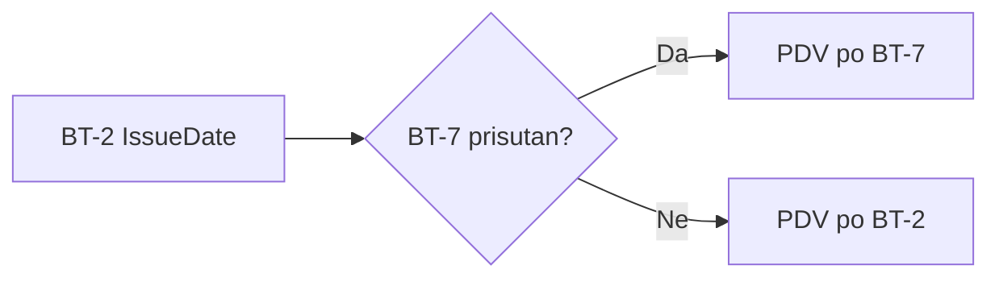

# Zašto GitHub

> **Tražite vodič za sudjelovanje u reviziji?** → [Vodič za reviziju](vodic-za-reviziju)
>
> **Tražite upute za email obavijesti?** → [Email obavijesti](github-obavijesti)

## Što je GitHub? {#sec-sto-je-github}

GitHub je **besplatna platforma** za suradnju na dokumentima i kodu. Koriste ga milijuni programera, tvrtki i organizacija diljem svijeta — uključujući Europsku komisiju za EN16931 specifikacije.

Ovaj projekt koristi GitHub jer:

- **Besplatan je** — za javne projekte nema nikakvih troškova, ni za održavatelje ni za suradnike
- **Transparentan** — svaka promjena je vidljiva, s autorom, datumom i obrazloženjem
- **Otvoren** — svatko može čitati dokumentaciju bez registracije
- **Verzioniran** — svaka izmjena je trajno sačuvana, moguće je vidjeti povijest i vratiti se na stariju verziju
- **Omogućuje strukturiranu suradnju** — Issues, Pull Requests, rasprave, glasanje
- **GitHub Pages** — automatski generira web stranicu iz dokumentacije

## Koliko košta? {#sec-koliko-kosta}

**Ništa.** GitHub je besplatan za javne projekte. Čitanje dokumentacije, pregled povijesti izmjena i pristup web stranici ne zahtijeva ni registraciju.

Za aktivno sudjelovanje (komentare, rasprave, prijedloge) potrebna je **besplatna registracija** — traje 2 minute na [github.com](https://github.com/signup).

## Tko još koristi GitHub za zakone, propise i dokumentaciju? {#sec-tko-jos-koristi}

GitHub nije samo za programere — koriste ga državne institucije, porezne uprave i zakonodavci diljem svijeta za otvorenu suradnju na propisima i dokumentaciji.

### Europska unija {#sec-europska-unija}

| Projekt | Opis | Link |
|---------|------|------|
| **EN16931 eInvoicing** | Specifikacije i schematron validatori za europski eRačun — isti standard koji i mi koristimo. Issues i rasprave su otvorene za sve. | [ConnectingEurope/eInvoicing-EN16931](https://github.com/ConnectingEurope/eInvoicing-EN16931) |
| **CEN/TC 434** | Tehnički odbor za elektroničko fakturiranje koji održava EN16931 normu. | [CenPC434](https://github.com/CenPC434) |
| **EU Digital Identity Wallet** | Arhitektura i referentni okvir za europski digitalni identitet — razvija se potpuno otvoreno. | [eu-digital-identity-wallet](https://github.com/eu-digital-identity-wallet/eudi-doc-architecture-and-reference-framework) |

### Porezne uprave {#sec-porezne-uprave}

| Projekt | Opis | Link |
|---------|------|------|
| **KoSIT (Njemačka)** | Njemački koordinacijski ured za IT standarde održava XRechnung specifikaciju javno na GitHubu — model koji predlažemo i za Hrvatsku. | [itplr-kosit](https://github.com/itplr-kosit) |
| **IRS Direct File (SAD)** | Američka porezna uprava (IRS) objavila besplatni softver za podnošenje poreznih prijava kao open source. | [IRS-Public/direct-file](https://github.com/IRS-Public/direct-file) |
| **IRS Fact Graph** | Američki porezni zakoni u strojno čitljivom formatu — deklarativni okvir za interpretaciju poreznih pravila. | [IRS-Public/fact-graph](https://github.com/IRS-Public/fact-graph) |

### Zakonodavci {#sec-zakonodavci}

| Projekt | Opis | Link |
|---------|------|------|
| **Washington DC** | Prvi zakonodavac na svijetu koji je objavio zakone na GitHubu i prihvatio izmjenu od građanina kroz Pull Request. | [DCCouncil/law-xml](https://github.com/DCCouncil/law-xml) |
| **Francuska (Legifrance)** | Francuski zakoni dostupni u strojno čitljivom formatu. | [Legifrance projekti](https://github.com/topics/legifrance) |
| **Government Open Source Policies** | Zbirka pristupa vlada diljem svijeta prema open source softveru. | [github/government-open-source-policies](https://github.com/github/government-open-source-policies) |

### Velike tvrtke {#sec-velike-tvrtke}

| Tvrtka | Opis | Link |
|--------|------|------|
| **Microsoft** | **Cjelokupna** dokumentacija (learn.microsoft.com) je na GitHubu — 800+ repozitorija. Svaki članak ima "Edit" gumb za predlaganje izmjena. | [MicrosoftDocs](https://github.com/MicrosoftDocs) |
| **Google** | Dokumentacija za Android, Kubernetes, TensorFlow, Go i stotine drugih projekata — sve otvoreno za doprinose. | [google](https://github.com/google) |
| **Meta (Facebook)** | React, React Native i ostala dokumentacija razvija se otvoreno na GitHubu. | [facebook](https://github.com/facebook) |

> **Poanta**: Ako Microsoft koristi GitHub za svu svoju dokumentaciju, njemački KoSIT za XRechnung specifikacije, američka IRS za porezne zakone, a Europska komisija za EN16931 — onda je GitHub apsolutno prikladno mjesto za zajedničku dokumentaciju o hrvatskim eRačunima.

## Kako čitati ovu dokumentaciju? {#sec-kako-citati}

### Na web stranici (najjednostavnije) {#sec-na-web-stranici}

Otvorite [dageci.github.io/eracun-fiskalizacija-datumi](https://dageci.github.io/eracun-fiskalizacija-datumi/) — formatirani prikaz s dijagramima, tablicama i navigacijom. **Ne treba registracija.**

### Na GitHubu {#sec-na-githubu}

Otvorite [github.com/dageci/eracun-fiskalizacija-datumi](https://github.com/dageci/eracun-fiskalizacija-datumi) — GitHub automatski prikazuje Markdown datoteke s formatiranjem i Mermaid dijagramima. **Ne treba registracija.**

---

## Kako sudjelovati? {#sec-kako-sudjelovati}

Za kompletne upute o sudjelovanju u reviziji pogledajte **[Vodič za reviziju](vodic-za-reviziju)**. Tamo je objašnjeno:

- Kako pronaći segment dokumentacije koji vas zanima
- Kako ostaviti komentar ili potvrdu ispravnosti
- Kako predložiti izmjenu kroz Pull Request
- Kako sudjelovati u radnim sastancima
- Sva Kanban stanja i što znače

Za praćenje napretka revizije: **[Napredak revizije](napredak)**.

Ako samo želite čitati dokumentaciju, ne trebate ništa — otvorite web stranicu i čitajte.

## Tko može sudjelovati? {#sec-tko-moze-sudjelovati}

Svi koji rade s hrvatskim eRačunima:

- **ERP programeri** — koji implementiraju kreiranje eRačun XML-a
- **Knjigovođe** — koji moraju razumjeti kako datumi utječu na PDV
- **Informacijski posrednici** — koji procesiraju eRačune (MER, PONDI, FINA)
- **Porezni savjetnici** — koji poznaju zakonski okvir
- **Predstavnici Porezne uprave** — koji mogu službeno potvrditi tumačenja
- **Studenti** — koji uče o e-fakturiranju

---

## GitHub pojmovi na hrvatskom {#sec-github-pojmovi}

Ako vam je GitHub sučelje na engleskom, evo što znače ključni pojmovi:

| GitHub pojam | Hrvatski | Što znači |
|---|---|---|
| **Star** | Zvjezdica | Označite projekt kao koristan — kao "sviđa mi se". Pomaže da projekt bude vidljiviji drugima. |
| **Watch** | Pratite | Pratite promjene — dobivate obavijesti o novim raspravama i izmjenama dokumentacije. |
| **Fork** | Kopija | Napravite svoju kopiju projekta na vašem računu, za predlaganje izmjena. |
| **Issue** | Prijava / tema | Pojedinačan zahtjev za pregledom, prijedlog ili pitanje. |
| **Pull Request** | Prijedlog izmjene | Predložite konkretnu izmjenu teksta koju održavatelj pregledava. |
| **Discussion** | Rasprava | Otvorena rasprava — pitanja, prijedlozi, iskustva. |
| **Label** | Oznaka | Kategorizacija Issueova — stranica, status, prioritet. |
| **Milestone** | Prekretnica | Grupa Issueova (npr. za jedan radni sastanak). |
| **Project Board** | Kanban tablica | Vizualni prikaz napretka po stanjima. |
| **Maintainer** | Održavatelj | Osoba koja pregledava prijedloge i upravlja projektom. |

## Što je Markdown? {#sec-sto-je-markdown}

Dokumentacija je napisana u **Markdown** formatu — jednostavan tekstualni format koji GitHub automatski prikazuje s formatiranjem (naslovi, tablice, linkovi, code blokovi). Ne trebate nikakav poseban softver — možete editirati u bilo kojem text editoru.

Primjer:
```
## Naslov sekcije

**Bold tekst** i *kurzivni tekst*

- Stavka liste
- Druga stavka

| Stupac 1 | Stupac 2 |
|----------|----------|
| Redak 1  | Podatak  |
```

## Što su Mermaid dijagrami? {#sec-sto-su-mermaid-dijagrami}

Dokumentacija koristi [Mermaid](https://mermaid.js.org/) dijagrame za vizualizaciju workflow-a i procesa. GitHub ih automatski renderira iz tekstualnog opisa — nema potrebe za crtanjem u grafičkom alatu.

Primjer:
````

````

## Licenca {#sec-licenca}

Projekt koristi **EUPL 1.2** licencu — slobodno koristite, dijelite i prilagođavajte uz:

- Navođenje autora
- Dijeljenje pod istim uvjetima

Puni tekst: [joinup.ec.europa.eu/collection/eupl/eupl-text-eupl-12](https://joinup.ec.europa.eu/collection/eupl/eupl-text-eupl-12)

---

*Imate pitanje o korištenju GitHuba za ovaj projekt? Otvorite [Discussion](https://github.com/dageci/eracun-fiskalizacija-datumi/discussions) — rado ćemo pomoći.*
