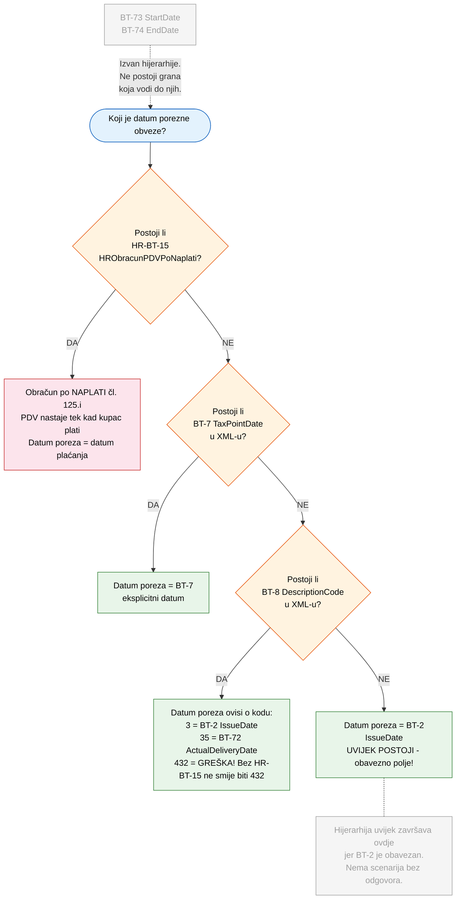
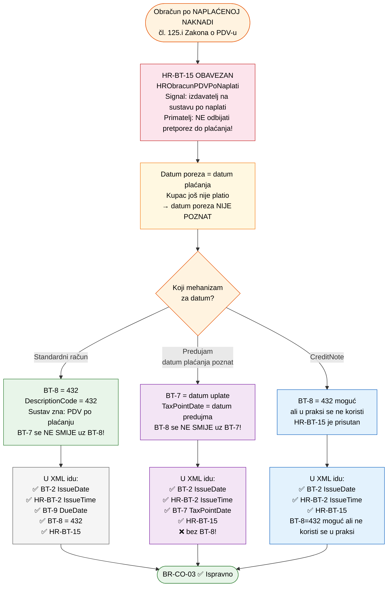

# Pravila i mehanizmi za određivanje datuma PDV obveze

Ova stranica pokriva pravila i mehanizme za određivanje datuma nastanka porezne obveze na eRačunu: pregled relevantnih BT polja, ključno pravilo BR-CO-03 s flowchart dijagramima za oba slučaja obračuna (po izdavanju i po naplati), te mogući kodovi za BT-8.

### Zašto ovaj dokument? {#sec-zasto-ovaj-dokument}
Pravila o datumima i poreznoj obvezi u eRačunu su razasuta po četiri izvora:

| Izvor | Što definira | Što NE definira |
|-------|-------------|-----------------|
| **Zakon o PDV-u** (čl. 30, 125.i) | Kada nastaje porezna obveza | Koji XML element koristiti |
| **Zakon o fiskalizaciji** (NN 89/25) | Koje podatke mora sadržavati eRačun | Kako ih popuniti u praksi |
| **HR CIUS specifikacija** | XML elemente i njihove tipove | Primjere po poslovnim slučajevima |
| **EN16931 norma** | Pravila poput BR-CO-03 | Specifičnosti hrvatskog PDV sustava |

Svaki izvor odgovara na svoj dio pitanja, ali nijedan ne spaja cjelinu: *"za ovaj poslovni slučaj, stavi ove podatke u ove XML elemente, a porezna obveza nastaje ovako"*.

Rezultat: svaka softverska kuća implementira svoju pretpostavku, ulazni XML-ovi su nekonzistentni, a automatsko knjiženje ulaznih eRačuna zahtijeva ručnu provjeru svakog računa.

Ovaj dokument pokušava spojiti sva četiri izvora u konkretne primjere. Svaka sekcija koja sadrži autorovo tumačenje označena je badge-om <span style="display:inline-block;background:#f39c12;color:white;font-size:0.72rem;font-weight:600;padding:0.15rem 0.55rem;border-radius:3px;cursor:help;" title="Ovo je autorovo tumačenje koje još nije službeno potvrđeno od Porezne uprave. Sadržaj treba tretirati kao prijedlog za raspravu, ne kao uputu.">Čeka potvrdu</span> — dok službena potvrda ne stigne, sadržaj treba tretirati kao prijedlog, ne kao uputu.

---

## 1. Pregled polja — što na što utječe {#sec-pregled-polja-sto}
### Osnovna referenca {#sec-osnovna-referenca}

> **Kako čitati ovu tablicu — redoslijed provjere za primatelja eRačuna:**
> 1. **Prvo provjeri HR-BT-15** — ako je prisutan, izdavatelj je na sustavu po naplaćenoj naknadi i PDV tretman se mijenja za cijeli račun (čl. 125.i)
> 2. **Tek onda** tumači BT-7/BT-8/BT-2 prema EU normi
>
> Svaki redak u tablici ispod sadrži napomenu **"osim ako je prisutan HR-BT-15"** gdje je to relevantno. Ovo je [HR specifičnost](#specificnost-hr-prosirenja) koja nema ekvivalenta u EU normi.

| BT | XML element | Hrvatski naziv | Obavezno | Utječe na | Isključuje se s |
|---|---|---|---|---|---|
| **BT-2** | `cbc:IssueDate` | Datum izdavanja računa | **DA** | PDV (default ako nema BT-7/BT-8), brojčanik računa, rok fiskalizacije. **Ako je prisutan HR-BT-15**: BT-2 više nije datum PDV-a — PDV nastaje tek po plaćanju | — |
| **HR-BT-2** | `cbc:IssueTime` | Vrijeme izdavanja računa | **DA** (HR) | Fiskalizacija (točan trenutak izdavanja) | — |
| **BT-7** | `cbc:TaxPointDate` | Datum nastanka obveze PDV-a | NE | **PDV** izdavatelja (eksplicitni datum), **pretporez** kupca. **Ako je prisutan HR-BT-15**: BT-7 označava datum plaćanja (kod predujma), ne datum isporuke | **BT-8** (BR-CO-03, fatal!) |
| **BT-8** | `cac:InvoicePeriod/cbc:DescriptionCode` | Kod datuma PDV obveze | NE | **PDV** (preko koda: 3=BT-2, 35=BT-72, 432=plaćanje). **Kod 432 i HR-BT-15 nose istu informaciju** — vidi [sekcija 3.1](#31-bt-8432-i-hr-bt-15--obračun-po-naplati-u-dva-elementa) | **BT-7** (BR-CO-03, fatal!) |
| **BT-9** | `cbc:DueDate` | Datum dospijeća plaćanja | NE | Likvidatura, cash flow, praćenje rokova plaćanja. HR-BR-4: obavezan ako BT-115 > 0 | — |
| **BT-72** | `cac:Delivery/cbc:ActualDeliveryDate` | Stvarni datum isporuke | NE | **Rashod/prihod** (HSFI 16), **skladišna primka**, garancije, PDV (ako BT-8=35). **Ako je prisutan HR-BT-15**: BT-72 i dalje vrijedi za rashod/prihod i primku, ali NE za datum PDV-a | — |
| **BT-73** | `cac:InvoicePeriod/cbc:StartDate` | Početak obračunskog razdoblja | NE | **Razgraničenje troškova**, pretplate, kontinuirane usluge | — |
| **BT-74** | `cac:InvoicePeriod/cbc:EndDate` | Kraj obračunskog razdoblja | NE | **Razgraničenje troškova**, pretplate, kontinuirane usluge | — |
| **HR-BT-15** | `hrextac:HRObracunPDVPoNaplati` | Obračun prema naplaćenoj naknadi | NE* | **Mijenja PDV režim cijelog računa**: izdavatelj prijavljuje PDV tek po plaćanju, primatelj ne smije odbiti pretporez prije plaćanja (čl. 125.i st. 3). **Ima prednost** nad BT-7/BT-8/BT-2 za određivanje PDV tretmana | — |

\* HR-BT-15 je **obavezan** za obveznike koji koriste obračun po naplaćenoj naknadi (čl. 125.i) — **u svakom računu**, uključujući CreditNote i predujam. To je svojstvo obveznika, ne pojedinačnog računa. BT-8=432 nije uvijek korišten u praksi (predujam koristi BT-7), ali HR-BT-15 je **uvijek** prisutan. Napomena: i BT-7 i BT-8 **postoje** u UBL CreditNote XSD shemi kao opcionalni elementi — u praksi se za odobrenja obično ne koriste, ali za CreditNote po naplati BT-8=432 bi se teoretski mogao primijeniti. Vidi [sekcija 3.1](#31-bt-8432-i-hr-bt-15--obračun-po-naplati-u-dva-elementa).

<a id="specificnost-hr-prosirenja"></a>
> **Specifičnost HR proširenja**: U EU normi, PDV tretman se u potpunosti određuje iz BT-7/BT-8/BT-2 — čist sustav, jedno polje, jedan mehanizam. Hrvatska dodaje HR-BT-15 koji **nije datumsko polje** nego **flag koji mijenja cijeli PDV režim**. Za primatelja eRačuna, HR-BT-15 je zapravo **najvažniji podatak za PDV** — važniji od BT-7 i BT-8 — jer mu kaže: "izdavatelj je na sustavu po naplaćenoj naknadi, ne smiješ odbiti pretporez dok ne platiš" (čl. 125.i st. 3). Bez HR-BT-15 primatelj ne zna pod kojim režimom je izdavatelj, čak i ako vidi BT-8=432. BT-7 i BT-8 **postoje** u UBL CreditNote XSD shemi kao opcionalni elementi, ali se u praksi za odobrenja ne koriste — a za CreditNote po naplati, BT-8=432 bi se teoretski mogao primijeniti. Za predujam se koristi BT-7 umjesto BT-8. U tim slučajevima HR-BT-15 služi kao dodatni signal za obračun po naplati, iako pitanje je koliko je on neophodan s obzirom na mogućnost korištenja BT-8=432 i u CreditNote. Ovo nema ekvivalenta u EU normi — Italija to rješava elegantno jednim poljem (`EsigibilitaIVA`), a ostale zemlje koriste samo BT-8=432. Vidi [europsku usporedbu](europska-usporedba#usporedna-tablica--svih-23-eu-zemlje).

### Kada se koje polje koristi — po scenarijima {#sec-kada-se-koje}

| Scenarij | BT-2 | HR-BT-2 | BT-7 | BT-8 | BT-9 | BT-72 | BT-73/74 | HR-BT-15 | Primjeri |
|---|:-:|:-:|:-:|:-:|:-:|:-:|:-:|:-:|---|
| Isporuka = datum računa | **DA** | **DA** | — | — | DA | —* | — | — | [Izd. 4.1.1](primjeri-izdavatelj#411-isporuka-i-račun-isti-dan-po-izdavanju), [Prim. P.1.1](primjeri-primatelj#p11-isporuka-i-račun-isti-dan) |
| Isporuka ≠ datum računa | **DA** | **DA** | **DA** | — | DA | DA | — | — | [Izd. 4.1.2](primjeri-izdavatelj#412-isporuka-u-drugom-mjesecu-od-računa-po-izdavanju), [Prim. P.1.2](primjeri-primatelj#p12-isporuka-u-drugom-mjesecu) |
| Račun prije isporuke | **DA** | **DA** | — | — | DA | DA | — | — | [Izd. 4.1.3](primjeri-izdavatelj#413-račun-izdan-prije-isporuke-čl-30-st-2-po-izdavanju), [Prim. P.1.3](primjeri-primatelj#p13-račun-izdan-prije-isporuke) |
| Predujam (po izdavanju) | **DA** | **DA** | **DA** | — | — | — | — | — | [Izd. 4.1.4](primjeri-izdavatelj#414-predujam-avansni-račun-čl-30-st-5-po-izdavanju), [Prim. P.1.4](primjeri-primatelj#p14-predujam--avansni-račun) |
| Kontinuirana usluga | **DA** | **DA** | **DA** | — | DA | — | **DA** | — | [Izd. 4.1.5](primjeri-izdavatelj#415-kontinuirana-usluga--obračunsko-razdoblje-bt-73-bt-74-po-izdavanju), [Prim. P.1.5](primjeri-primatelj#p15-kontinuirana-usluga) |
| BT-8=35 (auto isporuka) | **DA** | **DA** | — | **35** | DA | **DA** | — | — | [Izd. 4.1.6](primjeri-izdavatelj#416-bt-835--automatska-veza-na-datum-isporuke-po-izdavanju), [Prim. P.1.6](primjeri-primatelj#p16-bt-835--automatska-veza-na-datum-isporuke) |
| Odobrenje / CreditNote | **DA** | **DA** | — | — | — | — | — | — | [Izd. 4.1.7](primjeri-izdavatelj#417-odobrenje--creditnote-po-izdavanju), [Prim. P.1.7](primjeri-primatelj#p17-odobrenje--creditnote) |
| Po naplati (standardni) | **DA** | **DA** | — | **432** | **DA** | DA | — | **DA** | [Izd. 4.2.1](primjeri-izdavatelj#421-isporuka-i-račun-isti-mjesec-po-naplati), [Prim. P.2.1](primjeri-primatelj#p21-isporuka-i-račun-isti-mjesec) |
| Po naplati (drugi mjesec) | **DA** | **DA** | — | **432** | **DA** | DA | — | **DA** | [Izd. 4.2.2](primjeri-izdavatelj#422-isporuka-u-drugom-mjesecu-od-računa-po-naplati), [Prim. P.2.2](primjeri-primatelj#p22-isporuka-u-drugom-mjesecu) |
| Po naplati (predujam) | **DA** | **DA** | **DA** | — | — | — | — | **DA** | [Izd. 4.2.4](primjeri-izdavatelj#424-predujam-avansni-račun-po-naplati), [Prim. P.2.3](primjeri-primatelj#p23-predujam-po-naplati) |
| Po naplati (kontinuirana) | **DA** | **DA** | — | **432** | **DA** | — | **DA** | **DA** | [Izd. 4.2.5](primjeri-izdavatelj#425-kontinuirana-usluga-s-obračunskim-razdobljem-po-naplati) |
| Po naplati (CreditNote) | **DA** | **DA** | — | — | — | — | — | **DA** | [Izd. 4.2.6](primjeri-izdavatelj#426-odobrenje--creditnote-po-naplati), [Prim. P.2.4](primjeri-primatelj#p24-odobrenje--creditnote-po-naplati) |

\* BT-72 se ne mora navoditi kad je jednak BT-2, ali može.

> **HR-BT-15 u tablici iznad**: Primijetite da je HR-BT-15 prisutan u **svim** scenarijima "Po naplati" — uključujući predujam (gdje se koristi BT-7 umjesto BT-8) i CreditNote (gdje se BT-7/BT-8 u praksi ne koriste, iako **oba postoje** u UBL CreditNote XSD shemi kao opcionalni elementi). To potvrđuje da je HR-BT-15 **svojstvo obveznika** (uvijek prisutan kad je obveznik na čl. 125.i), dok je BT-8=432 **mehanizam za datum** (prisutan kad je primjenjiv). Napomena: za CreditNote po naplati, BT-8=432 bi se teoretski mogao koristiti — što dodatno otvara pitanje je li HR-BT-15 zaista neophodan kao zasebni element. Detaljna analiza: [sekcija 3.1](#31-bt-8432-i-hr-bt-15--obračun-po-naplati-u-dva-elementa).

### Što svako polje znači za koga {#sec-sto-svako-polje}

| BT | Izdavatelj (porez) | Primatelj (pretporez) | Računovođa (trošak) | Skladištar (primka) |
|---|---|---|---|---|
| **BT-2** | Datum brojčanika; default PDV ako nema BT-7/BT-8 — **osim ako je prisutan HR-BT-15** (tada PDV po plaćanju) | Datum primitka računa ≈ BT-2 kod eRačuna | — | — |
| **BT-7** | U koji mjesec ide PDV — **osim ako je prisutan HR-BT-15** (tada BT-7 označava datum plaćanja, ne isporuke) | [Kad nastaje pravo na pretporez](primjeri-primatelj#pretporez-dva-uvjeta-i-nijanse-u-praksi) (čl. 57) — **osim ako je prisutan HR-BT-15** (tada pretporez tek po plaćanju) | — | — |
| **BT-8** | Kako sustav određuje datum PDV-a; **432 = obračun po naplati** (isto značenje kao HR-BT-15) | 432 = pretporez tek po plaćanju; **isto značenje kao HR-BT-15** — vidi [3.1](#31-bt-8432-i-hr-bt-15--obračun-po-naplati-u-dva-elementa) | — | — |
| **BT-9** | Rok plaćanja za likvidaturu i cash flow. HR-BR-4: obavezan ako BT-115 > 0 | Rok plaćanja za likvidaturu | — | — |
| **BT-72** | Datum isporuke za PDV (s BT-7 ili BT-8=35) — **ako je prisutan HR-BT-15**, BT-72 NE utječe na PDV ali i dalje na rashod i primku | — | **Kad priznati rashod** (HSFI 16) — neovisno o HR-BT-15 | **Kad knjižiti primku** — neovisno o HR-BT-15 |
| **BT-73/74** | Informacija za kupca | — | **Razgraničenje troškova** po mjesecima — neovisno o HR-BT-15 | — |
| **HR-BT-15** | Fiskalizacijska poruka za PU — **mijenja PDV režim cijelog računa** | **PRVO PROVJERITI**: ako je prisutan, pretporez tek po plaćanju neovisno o BT-7/BT-8/BT-2 | Rashod se i dalje priznaje po BT-72, ali PDV tretman je drugačiji | — |

> **Detaljni primjeri utjecaja BT-72 i BT-73/74 na trošak, prihod i skladište:**
> - Izdavateljeva perspektiva: [Primjeri — izdavatelj](primjeri-izdavatelj#utjecaj-bt-72-i-bt-7374-na-prihod-i-otpremnicu-izdavatelj)
> - Primateljeva perspektiva: [Primjeri — primatelj](primjeri-primatelj#bt-72-datum-isporuke--utjecaj-na-trošak-prihod-i-skladište)

---

## 2. Ključno pravilo: BR-CO-03 {#sec-kljucno-pravilo-br-03}

> **BR-CO-03**: Europska norma EN16931 propisuje da se **BT-7** i **BT-8** **međusobno isključuju**.
>
> - **BT-7** / Datum nastanka obveze PDV-a (`cbc:TaxPointDate`) — eksplicitni datum
> - **BT-8** / Kod datuma PDV obveze (`cac:InvoicePeriod/cbc:DescriptionCode`) — kod koji upućuje na drugi podatak
>
> Oba služe istoj svrsi: definiranju kada nastaje obveza PDV-a. Ako bi oba bila prisutna,
> sustav ne bi znao koji ima prednost. Ovo pravilo je **`flag="fatal"`** u Schematron validatoru
> — račun koji sadrži oba polja bit će **odbijen**.

> **Važno:** Hrvatska ima dva načina obračuna PDV-a — **po izdavanju** (čl. 30 Zakona o PDV-u) i **po naplaćenoj naknadi** (čl. 125.i). XML mehanizam za određivanje datuma poreza (BT-7 / BT-8 / BT-2) je isti za oba, ali značenje je različito: kod obračuna po izdavanju datum poreza je **poznat** u trenutku izdavanja računa (= datum isporuke), kod obračuna po naplati datum **nije poznat** (= datum plaćanja u budućnosti). Oba slučaja su detaljno razrađena s flowchart dijagramima u nastavku ove sekcije ([Slučaj 1](#slučaj-1-obračun-po-izdavanju-čl-30-zakona-o-pdv-u), [Slučaj 2](#slučaj-2-obračun-po-naplaćenoj-naknadi-čl-125i-zakona-o-pdv-u)).

### Dozvoljene kombinacije prisutnosti polja u XML dokumentu {#sec-dozvoljene-kombinacije-prisutnosti-dok}

| | BT-7 | BT-8 | Rezultat | Kako se određuje datum porezne obveze |
|:---:|:---:|:---:|:---:|:---|
| 1. | — | — | **Ispravno** | Porezna obveza = BT-2 / Datum izdavanja (`cbc:IssueDate`). **Najčešći slučaj.** (osim ako je prisutan HR-BT-15 — tada PDV po plaćanju) |
| 2. | **DA** | — | **Ispravno** | Porezna obveza = eksplicitni datum u BT-7 (`cbc:TaxPointDate`) |
| 3. | — | **DA** | **Ispravno** | Porezna obveza se određuje prema kodu u BT-8 (vidi sekciju 3) |
| 4. | **DA** | **DA** | **GREŠKA!** | Schematron validator **ODBIJA** račun (BR-CO-03) |

### Što određuje datum poreza, a što NE {#sec-sto-odreduje-datum-ne}

> **Kako odrediti datum nastanka porezne obveze** — redoslijed provjere:
> 1. **HR-BT-15** — ako je prisutan, PDV nastaje tek po plaćanju (čl. 125.i), neovisno o BT-7/BT-8/BT-2
> 2. **BT-7** (`cbc:TaxPointDate`) — eksplicitni datum, ili
> 3. **BT-8** (`cbc:DescriptionCode`) — kod koji upućuje na drugi datum, ili
> 4. **BT-2** (`cbc:IssueDate`) — default ako nema ni BT-7 ni BT-8
>
> **BT-73/BT-74 NIKADA ne utječu na datum nastanka porezne obveze** — uvijek su informativni.



> **Napomena o BT-8=432 bez HR-BT-15**: U dijagramu iznad, kombinacija BT-8=432 bez HR-BT-15 je označena kao greška. Za ovu nekonzistentnost predložili smo validator pravilo **[HR-BR-GECI-F01](prijedlozi-validator#f01-ako-bt-8432-zahtijevaj-hr-bt-15)** (`flag="fatal"`) — račun s BT-8=432 bez HR-BT-15 bi trebao biti **odbijen** jer signalizira obračun po naplati kroz EU normu ali nema HR proširenje koje to potvrđuje.

### Brojčanik računa i BT-2 (IssueDate) {#sec-brojcanik-racuna-i}

> Redni broj računa (brojčanik) uvijek se vrti prema **BT-2 / Datum izdavanja računa
> (`cbc:IssueDate`)**, bez obzira na koje se porezno razdoblje račun odnosi.
>
> Primjer: IT podrška obavljena u prosincu 2025., račun izdan 10.01.2026.
> - Broj računa: **1/1/1** (prvi račun u 2026. godini)
> - BT-2 (`cbc:IssueDate`): 2026-01-10
> - Datum nastanka porezne obveze: 2025-12-31 (određen kroz BT-7 ili BT-8, ovisno o situaciji)
>
> Brojčanik pripada **2026.** (po datumu izdavanja), iako PDV ide u **2025.**
> (po datumu nastanka porezne obveze). Ovo je u skladu sa Zakonom o fiskalizaciji
> (čl. 8 i 9) — broj računa prati kronološki redoslijed izdavanja, ne porezno razdoblje.

---

### Slučaj 1: Obračun po izdavanju (čl. 30 Zakona o PDV-u) {#sec-slucaj-1-obracun-u}

<div style="margin-top:-0.5rem;margin-bottom:0.5rem;"><span style="display:inline-block;background:#f39c12;color:white;font-size:0.72rem;font-weight:600;padding:0.15rem 0.55rem;border-radius:3px;cursor:help;" title="Ovo je autorovo tumačenje koje još nije službeno potvrđeno od Porezne uprave. Sadržaj treba tretirati kao prijedlog za raspravu, ne kao uputu.">Čeka potvrdu</span></div>

> *"Oporezivi događaj i obveza obračuna PDV-a nastaju kada su dobra isporučena ili usluge obavljene."*
> — Čl. 30, st. 1 Zakona o PDV-u
>
> Datum poreza je poznat u trenutku izdavanja računa i jednak je **datumu isporuke**.

> **Preduvjet**: HR-BT-15 NIJE prisutan u eRačunu. Ako jest, vidi [Slučaj 2](#slučaj-2-obračun-po-naplaćenoj-naknadi-čl-125i-zakona-o-pdv-u).


> **Primjer**: Roba isporučena 28.03., račun izdan 05.04.
> BT-7 (`cbc:TaxPointDate`) = 2026-03-28 → PDV ulazi u **ožujak**, ne u travanj.
>
> **Standardni slučajevi** (pokriveni dijagramom): [4.1.1 Isti dan](primjeri-izdavatelj#411-isporuka-i-račun-isti-dan-po-izdavanju), [4.1.2 Drugi mjesec](primjeri-izdavatelj#412-isporuka-u-drugom-mjesecu-od-računa-po-izdavanju), [4.1.4 Predujam](primjeri-izdavatelj#414-predujam-avansni-račun-čl-30-st-5-po-izdavanju), [4.1.6 BT-8=35](primjeri-izdavatelj#416-bt-835--automatska-veza-na-datum-isporuke-po-izdavanju), [4.1.8 Svi datumi različiti](primjeri-izdavatelj#418-svi-datumi-u-različitim-mjesecima--bt-7-eksplicitni-datum-po-izdavanju)
>
> **Specijalni slučajevi** (nisu u dijagramu jer bi sa svim kombinacijama postao nepregledan — detaljno razrađeni u primjerima): [4.1.3 Račun prije isporuke](primjeri-izdavatelj#413-račun-izdan-prije-isporuke-čl-30-st-2-po-izdavanju) (čl. 30 st. 2 — PDV po datumu računa, ne isporuke), [4.1.5 Kontinuirana usluga](primjeri-izdavatelj#415-kontinuirana-usluga--obračunsko-razdoblje-bt-73-bt-74-po-izdavanju) (BT-7 = kraj razdoblja, nema BT-72), [4.1.7 Odobrenje](primjeri-izdavatelj#417-odobrenje--creditnote-po-izdavanju) (BT-7 i BT-8 postoje u CreditNote shemi ali se u praksi za odobrenja ne koriste — BT-2 služi kao default datum poreza)

---

### Slučaj 2: Obračun po naplaćenoj naknadi (čl. 125.i Zakona o PDV-u) {#sec-slucaj-2-obracun-zak}

<div style="margin-top:-0.5rem;margin-bottom:0.5rem;"><span style="display:inline-block;background:#f39c12;color:white;font-size:0.72rem;font-weight:600;padding:0.15rem 0.55rem;border-radius:3px;cursor:help;" title="Ovo je autorovo tumačenje koje još nije službeno potvrđeno od Porezne uprave. Sadržaj treba tretirati kao prijedlog za raspravu, ne kao uputu.">Čeka potvrdu</span></div>

> *"Porezni obveznik koji primjenjuje postupak oporezivanja prema naplaćenim naknadama,*
> *obvezu obračuna PDV-a ima u trenutku primitka plaćanja."*
> — Čl. 125.i Zakona o PDV-u
>
> Datum poreza u trenutku izdavanja računa **nije poznat** — ovisi o tome kada će kupac platiti.



> **Primjer**: Račun izdan 15.03., roba isporučena 10.03., kupac plaća 20.05.
> PDV obveza nastaje tek **20.05.** kada kupac plati.
> Na ispisu računa polje "Datum poreza" je **skriveno** jer datum još nije poznat.
>
> **HR-BT-15 napomena**: Posrednik iz elementa `hrextac:HRObracunPDVPoNaplati`
> (s tekstom *"Obračun prema naplaćenoj naknadi"*) generira SOAP poruku za
> `EvidentirajERacun` prema Poreznoj upravi, koja označava da se za ovaj račun
> primjenjuje postupak oporezivanja prema naplaćenim naknadama (čl. 125.i Zakona o PDV-u).
>
> XML primjeri za ovaj slučaj: [4.2.1 Isti mjesec](primjeri-izdavatelj#421-isporuka-i-račun-isti-mjesec-po-naplati), [4.2.2 Drugi mjesec](primjeri-izdavatelj#422-isporuka-u-drugom-mjesecu-od-računa-po-naplati), [4.2.3 Račun prije isporuke](primjeri-izdavatelj#423-račun-izdan-prije-isporuke-po-naplati), [4.2.4 Predujam](primjeri-izdavatelj#424-predujam-avansni-račun-po-naplati), [4.2.5 Kontinuirana](primjeri-izdavatelj#425-kontinuirana-usluga-s-obračunskim-razdobljem-po-naplati), [4.2.6 Odobrenje](primjeri-izdavatelj#426-odobrenje-creditnote-po-naplati)

---

## 3. Mogući kodovi za BT-8 {#sec-moguci-kodovi-za-8}

<div style="margin-top:-0.8rem;margin-bottom:1rem;"><span style="display:inline-block;background:#f39c12;color:white;font-size:0.72rem;font-weight:600;padding:0.15rem 0.55rem;border-radius:3px;cursor:help;" title="Ovo je autorovo tumačenje koje još nije službeno potvrđeno od Porezne uprave. Sadržaj treba tretirati kao prijedlog za raspravu, ne kao uputu.">Čeka potvrdu</span></div>

| Kod | Značenje | Porezna obveza = | Kada se koristi |
|:---:|----------|------------------|-----------------|
| **3** | Datum izdavanja | BT-2 / Datum izdavanja računa (`cbc:IssueDate`) | Redundantno — isto kao default kad nema ni BT-7 ni BT-8 |
| **35** | Datum isporuke | BT-72 / Stvarni datum isporuke (`cbc:ActualDeliveryDate`) | Kad želimo automatski vezati poreznu obvezu na datum isporuke |
| **432** | Datum plaćanja | Datum kad kupac plati račun | **Obračun po naplaćenoj naknadi (čl. 125.i Zakona o PDV-u)**. U praksi uvijek uz HR-BT-15 |

### 3.1 BT-8=432 i HR-BT-15 — obračun po naplati u dva elementa {#sec-bt-8432-i}

<div style="margin-top:-0.8rem;margin-bottom:1rem;"><span style="display:inline-block;background:#f39c12;color:white;font-size:0.72rem;font-weight:600;padding:0.15rem 0.55rem;border-radius:3px;cursor:help;" title="Ovo je autorovo tumačenje koje još nije službeno potvrđeno od Porezne uprave. Sadržaj treba tretirati kao prijedlog za raspravu, ne kao uputu.">Čeka potvrdu</span></div>

Kod `432` signalizira obračun po naplaćenoj naknadi kroz EU normu (BT-8). Istovremeno, HR proširenje definira zaseban element za isti podatak (HR-BT-15). Oba nose istu informaciju — da izdavatelj obračunava PDV po naplati.

**BT-8** — element iz EU norme EN16931 (`0..1`):

```xml
<cac:InvoicePeriod>
  <cbc:DescriptionCode>432</cbc:DescriptionCode>
</cac:InvoicePeriod>
```

**HR-BT-15** — element iz HR proširenja HRFISK20Data (`0..1`):

```xml
<hrextac:HRFISK20Data>
  <hrextac:HRObracunPDVPoNaplati>Obračun prema naplaćenoj naknadi</hrextac:HRObracunPDVPoNaplati>
</hrextac:HRFISK20Data>
```

HR CIUS specifikacija (Tablica 52) definira: *"Porezni obveznik koji primjenjuje postupak oporezivanja prema naplaćenim naknadama na računu mora navesti 'Obračun prema naplaćenim naknadama'."*

**Treba li HR-BT-15 uopće?**

Nakon analize XSD sheme i svih scenarija, postavlja se pitanje: **pokriva li BT-8=432 iz EU norme sve slučajeve, čineći HR-BT-15 nepotrebnim?**

| Scenarij | BT-8=432 moguć? | HR-BT-15 prisutan? | Što bi bilo bez HR-BT-15? |
|---|---|---|---|
| Standardni račun po naplati | **DA** | DA | BT-8=432 dovoljan — primatelj vidi kod 432 = "plaćanje" |
| Kontinuirana usluga po naplati | **DA** | DA | BT-8=432 dovoljan |
| CreditNote po naplati | **DA** — BT-8 postoji u CreditNote XSD shemi | DA | BT-8=432 bi mogao signalizirati režim |
| Predujam po naplati | NE — koristi BT-7 (datum plaćanja poznat) | DA | BT-7 pokazuje datum uplate; ali odakle primatelj zna da je to "po naplati" a ne "po izdavanju"? |

**Jedini scenarij** gdje BT-8=432 ne može preuzeti ulogu HR-BT-15 je **predujam** — jer tu koristimo BT-7 (datum je poznat), ne BT-8. Ali kod predujma je kupac **već platio**, pa pitanje pretporeza je ionako riješeno — pretporez ide u mjesec plaćanja u oba režima.

**Argumenti za HR-BT-15 (zašto možda treba):**

1. **Zakonski zahtjev** — čl. 125.i Zakona o PDV-u traži da obveznik na računu **navede** da koristi obračun po naplaćenoj naknadi. BT-8=432 je numerički kod koji čovjek ne može pročitati na ispisu računa, dok HR-BT-15 sadrži tekst "Obračun prema naplaćenoj naknadi"
2. **Fiskalizacijska poruka** — posrednik iz HR-BT-15 generira SOAP poruku za `EvidentirajERacun` prema PU. U Tehničkoj specifikaciji Fiskalizacija eRačuna (Tablica 6, stupac "EU Norma") **ne postoji mapiranje** koje referencira BT-8 — fiskalizacijska poruka ne prenosi BT-8 prema Poreznoj upravi
3. **Jasnoća za primatelja** — tekstualna napomena je jednoznačna, numerički kod zahtijeva lookup tablicu

**Argumenti protiv HR-BT-15 (zašto možda ne treba):**

1. **BT-8=432 je dovoljan signal** za softver — primatelj koji primi eRačun s BT-8=432 automatski zna da je obračun po naplati
2. **Dupliciranje podatka** — ista informacija na dva mjesta povećava rizik nekonzistentnosti (što ako BT-8=432 ali HR-BT-15 nedostaje, ili obrnuto?)
3. **Nijedna druga EU zemlja** nema ovakvo proširenje — Italija koristi jedno polje (`EsigibilitaIVA`), ostale koriste samo BT-8=432. Vidi [europsku usporedbu](europska-usporedba#usporedna-tablica--svih-23-eu-zemlje)
4. **Tekstualna napomena** na ispisu računa može se generirati iz BT-8=432 — softver koji ispisuje račun može mapirati kod 432 u tekst "Obračun prema naplaćenoj naknadi" bez potrebe za zasebnim XML elementom

**Otvorena pitanja za Poreznu upravu:**

1. Je li HR-BT-15 uveden zbog zakonskog zahtjeva za tekstualnom napomenom (čl. 125.i), ili zbog tehničke potrebe fiskalizacijske poruke?
2. Bi li BT-8=432 sam bio dovoljan da sustav fiskalizacije prepozna obračun po naplati?
3. Ako su oba prisutna, koji ima prednost u slučaju konflikta (BT-8≠432 ali HR-BT-15 prisutan)?
4. Zašto fiskalizacijska poruka (Tablica 6) ne prenosi BT-8 prema PU?

> **Napomena iz primjera:** U sekciji [4.2](primjeri-izdavatelj#42-obračun-po-naplaćenoj-naknadi-čl-125i-zakona-o-pdv-u) svi primjeri obračuna po naplati koriste HR-BT-15, dok BT-8=432 nije uvijek korišten — [predujam (4.2.4)](primjeri-izdavatelj#424-predujam-avansni-račun-po-naplati) koristi BT-7, a [CreditNote (4.2.6)](primjeri-izdavatelj#426-odobrenje--creditnote-po-naplati) u praksi ne koristi BT-8 (iako **postoji** u CreditNote XSD shemi). No ovo je autorovo tumačenje — čekamo službenu potvrdu.

> **PU pojašnjenje (19.12.2025., pitanje 188)**: eIzvještavanje o naplati je obvezno za **sve** obveznike (ne samo za one na sustavu po naplati) — zamjenjuje OPZ-STAT-1. To znači da je BT-115 (PayableAmount) relevantan za sve eRačune. BT-9 (DueDate) je rok plaćanja — obavezan po HR-BR-4 kad je BT-115 > 0, ali nije direktno vezan uz eIzvještavanje o naplati (koje se odnosi na stvarni datum plaćanja, ne rok).

---

---
