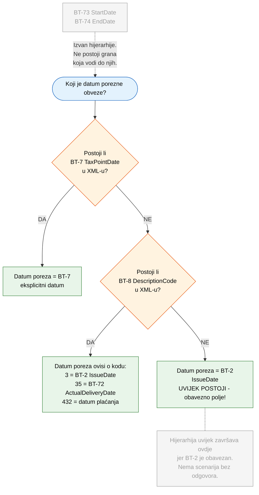
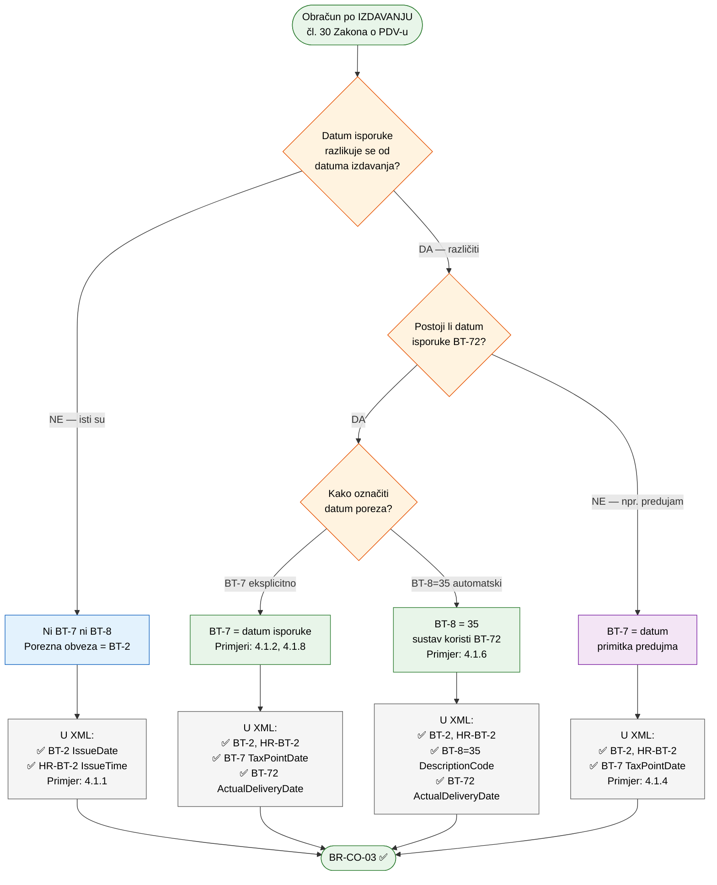
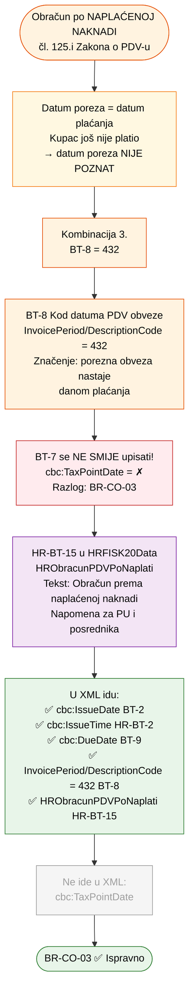

# Pravila i mehanizmi za određivanje datuma PDV obveze

Ova stranica pokriva pravila i mehanizme za određivanje datuma nastanka porezne obveze na eRačunu: pregled relevantnih BT polja, ključno pravilo BR-CO-03 s flowchart dijagramima za oba slučaja obračuna (po izdavanju i po naplati), te mogući kodovi za BT-8.

### Zašto ovaj dokument?

Pravila o datumima i poreznoj obvezi u eRačunu su razasuta po četiri izvora:

| Izvor | Što definira | Što NE definira |
|-------|-------------|-----------------|
| **Zakon o PDV-u** (čl. 30, 125.i) | Kada nastaje porezna obveza | Koji XML element koristiti |
| **Zakon o fiskalizaciji** (NN 89/25) | Koje podatke mora sadržavati eRačun | Kako ih popuniti u praksi |
| **HR CIUS specifikacija** | XML elemente i njihove tipove | Primjere po poslovnim slučajevima |
| **EN16931 norma** | Pravila poput BR-CO-03 | Specifičnosti hrvatskog PDV sustava |

Svaki izvor odgovara na svoj dio pitanja, ali nijedan ne spaja cjelinu: *"za ovaj poslovni slučaj, stavi ove podatke u ove XML elemente, a porezna obveza nastaje ovako"*.

Rezultat: svaka softverska kuća implementira svoju pretpostavku, ulazni XML-ovi su nekonzistentni, a automatsko knjiženje ulaznih eRačuna zahtijeva ručnu provjeru svakog računa.

Ovaj dokument pokušava spojiti sva četiri izvora u konkretne primjere. Svaka sekcija koja sadrži autorovo tumačenje označena je badge-om <span style="display:inline-block;background:#f39c12;color:white;font-size:0.72rem;font-weight:600;padding:0.15rem 0.55rem;border-radius:3px;">Čeka potvrdu</span> — dok službena potvrda ne stigne, sadržaj treba tretirati kao prijedlog, ne kao uputu.

---

## 1. Pregled polja

| BT polje | XML element | Hrvatski naziv | Obavezno? | Opis |
|----------|-------------|----------------|-----------|------|
| **BT-2** | `cbc:IssueDate` | Datum izdavanja računa | **DA** | Kada je račun izdan |
| **HR-BT-2** | `cbc:IssueTime` | Vrijeme izdavanja računa | **DA** (HR) | Točno vrijeme izdavanja (hh:mm:ss) |
| **BT-7** | `cbc:TaxPointDate` | Datum nastanka obveze PDV-a | NE | Eksplicitni datum kada nastaje porezna obveza |
| **BT-8** | `cac:InvoicePeriod/cbc:DescriptionCode` | Kod datuma PDV obveze | NE | Kod koji govori KAKO odrediti datum porezne obveze |
| **BT-9** | `cbc:DueDate` | Datum dospijeća plaćanja | NE | Rok do kojeg kupac treba platiti |
| **BT-72** | `cac:Delivery/cbc:ActualDeliveryDate` | Stvarni datum isporuke | NE | Kada je roba isporučena ili usluga obavljena |
| **BT-73** | `cac:InvoicePeriod/cbc:StartDate` | Početak obračunskog razdoblja | NE | Za periodične račune (pretplate, najam...) |
| **BT-74** | `cac:InvoicePeriod/cbc:EndDate` | Kraj obračunskog razdoblja | NE | Za periodične račune (pretplate, najam...) |
| **HR-BT-15** | `hrextac:HRObracunPDVPoNaplati` | Obračun prema naplaćenoj naknadi | NE | Oznaka u HRFISK20Data bloku za čl. 125.i |

---

## 2. Ključno pravilo: BR-CO-03

> **BR-CO-03**: Europska norma EN16931 propisuje da se **BT-7** i **BT-8** **međusobno isključuju**.
>
> - **BT-7** / Datum nastanka obveze PDV-a (`cbc:TaxPointDate`) — eksplicitni datum
> - **BT-8** / Kod datuma PDV obveze (`cac:InvoicePeriod/cbc:DescriptionCode`) — kod koji upućuje na drugi podatak
>
> Oba služe istoj svrsi: definiranju kada nastaje obveza PDV-a. Ako bi oba bila prisutna,
> sustav ne bi znao koji ima prednost. Ovo pravilo je **`flag="fatal"`** u Schematron validatoru
> — račun koji sadrži oba polja bit će **odbijen**.

> **Važno:** Hrvatska ima dva načina obračuna PDV-a — **po izdavanju** (čl. 30 Zakona o PDV-u) i **po naplaćenoj naknadi** (čl. 125.i). XML mehanizam za određivanje datuma poreza (BT-7 / BT-8 / BT-2) je isti za oba, ali značenje je različito: kod obračuna po izdavanju datum poreza je **poznat** u trenutku izdavanja računa (= datum isporuke), kod obračuna po naplati datum **nije poznat** (= datum plaćanja u budućnosti). Oba slučaja su detaljno razrađena s flowchart dijagramima u nastavku ove sekcije ([Slučaj 1](#slučaj-1-obračun-po-izdavanju-čl-30-zakona-o-pdv-u), [Slučaj 2](#slučaj-2-obračun-po-naplaćenoj-naknadi-čl-125i-zakona-o-pdv-u)).

### Dozvoljene kombinacije prisutnosti polja u XML dokumentu

| | BT-7 | BT-8 | Rezultat | Kako se određuje datum porezne obveze |
|:---:|:---:|:---:|:---:|:---|
| 1. | — | — | **Ispravno** | Porezna obveza = BT-2 / Datum izdavanja (`cbc:IssueDate`). **Najčešći slučaj.** |
| 2. | **DA** | — | **Ispravno** | Porezna obveza = eksplicitni datum u BT-7 (`cbc:TaxPointDate`) |
| 3. | — | **DA** | **Ispravno** | Porezna obveza se određuje prema kodu u BT-8 (vidi sekciju 3) |
| 4. | **DA** | **DA** | **GREŠKA!** | Schematron validator **ODBIJA** račun (BR-CO-03) |

### Što određuje datum poreza, a što NE

> **Datum nastanka porezne obveze** uvijek određuje isključivo:
> 1. **BT-7** (`cbc:TaxPointDate`) — eksplicitni datum, ili
> 2. **BT-8** (`cbc:DescriptionCode`) — kod koji upućuje na drugi datum, ili
> 3. **BT-2** (`cbc:IssueDate`) — default ako nema ni BT-7 ni BT-8
>
> **BT-73 / Početak obračunskog razdoblja (`cbc:StartDate`) i BT-74 / Kraj obračunskog
> razdoblja (`cbc:EndDate`) NIKADA ne utječu na datum nastanka porezne obveze.**
> Oni su uvijek isključivo informativni — govore primatelju računa za koje vremensko
> razdoblje se račun odnosi (npr. "najam za siječanj–ožujak").
>
> Razlog: datum porezne obveze se **uvijek** određuje kroz gornja tri polja po sljedećoj
> hijerarhiji. Ključno je da **BT-2 (IssueDate) uvijek postoji** — to je obavezno polje
> (HR-BR-40). Zato hijerarhija uvijek ima odgovor i nikada ne može doći u stanje
> "nema datuma poreza" — što znači da BT-73/BT-74 nikada ne mogu doći na red
> kao zamjena. Oni su isključivo informativni i mogu se dodati u bilo koji račun
> bez ikakve promjene u PDV tretmanu.



### Brojčanik računa i BT-2 (IssueDate)

> Redni broj računa (brojčanik) uvijek se vrti prema **BT-2 / Datum izdavanja računa
> (`cbc:IssueDate`)**, bez obzira na koje se porezno razdoblje račun odnosi.
>
> Primjer: IT podrška obavljena u prosincu 2025., račun izdan 10.01.2026.
> - Broj računa: **1/1/1** (prvi račun u 2026. godini)
> - BT-2 (`cbc:IssueDate`): 2026-01-10
> - Datum nastanka porezne obveze: 2025-12-31 (određen kroz BT-7 ili BT-8, ovisno o situaciji)
>
> Brojčanik pripada **2026.** (po datumu izdavanja), iako PDV ide u **2025.**
> (po datumu nastanka porezne obveze). Ovo je u skladu sa Zakonom o fiskalizaciji
> (čl. 8 i 9) — broj računa prati kronološki redoslijed izdavanja, ne porezno razdoblje.

---

### Slučaj 1: Obračun po izdavanju (čl. 30 Zakona o PDV-u)
<div style="margin-top:-0.5rem;margin-bottom:0.5rem;"><span style="display:inline-block;background:#f39c12;color:white;font-size:0.72rem;font-weight:600;padding:0.15rem 0.55rem;border-radius:3px;">Čeka potvrdu</span></div>

> *"Oporezivi događaj i obveza obračuna PDV-a nastaju kada su dobra isporučena ili usluge obavljene."*
> — Čl. 30, st. 1 Zakona o PDV-u
>
> Datum poreza je poznat u trenutku izdavanja računa i jednak je **datumu isporuke**.



> **Primjer**: Roba isporučena 28.03., račun izdan 05.04.
> BT-7 (`cbc:TaxPointDate`) = 2026-03-28 → PDV ulazi u **ožujak**, ne u travanj.
>
> **Standardni slučajevi** (pokriveni dijagramom): [4.1.1 Isti dan](primjeri-izdavatelj#411-isporuka-i-račun-isti-dan-po-izdavanju), [4.1.2 Drugi mjesec](primjeri-izdavatelj#412-isporuka-u-drugom-mjesecu-od-računa-po-izdavanju), [4.1.4 Predujam](primjeri-izdavatelj#414-predujam-avansni-račun-čl-30-st-5-po-izdavanju), [4.1.6 BT-8=35](primjeri-izdavatelj#416-bt-835--automatska-veza-na-datum-isporuke-po-izdavanju), [4.1.8 Svi datumi različiti](primjeri-izdavatelj#418-svi-datumi-u-različitim-mjesecima--bt-7-eksplicitni-datum-po-izdavanju)
>
> **Specijalni slučajevi** (nisu u dijagramu jer bi sa svim kombinacijama postao nepregledan — detaljno razrađeni u primjerima): [4.1.3 Račun prije isporuke](primjeri-izdavatelj#413-račun-izdan-prije-isporuke-čl-30-st-2-po-izdavanju) (čl. 30 st. 2 — PDV po datumu računa, ne isporuke), [4.1.5 Kontinuirana usluga](primjeri-izdavatelj#415-kontinuirana-usluga--obračunsko-razdoblje-bt-73-bt-74-po-izdavanju) (BT-7 = kraj razdoblja, nema BT-72), [4.1.7 Odobrenje](primjeri-izdavatelj#417-odobrenje--creditnote-po-izdavanju) (BT-7 ne postoji u CreditNote shemi)

---

### Slučaj 2: Obračun po naplaćenoj naknadi (čl. 125.i Zakona o PDV-u)
<div style="margin-top:-0.5rem;margin-bottom:0.5rem;"><span style="display:inline-block;background:#f39c12;color:white;font-size:0.72rem;font-weight:600;padding:0.15rem 0.55rem;border-radius:3px;">Čeka potvrdu</span></div>

> *"Porezni obveznik koji primjenjuje postupak oporezivanja prema naplaćenim naknadama,*
> *obvezu obračuna PDV-a ima u trenutku primitka plaćanja."*
> — Čl. 125.i Zakona o PDV-u
>
> Datum poreza u trenutku izdavanja računa **nije poznat** — ovisi o tome kada će kupac platiti.



> **Primjer**: Račun izdan 15.03., roba isporučena 10.03., kupac plaća 20.05.
> PDV obveza nastaje tek **20.05.** kada kupac plati.
> Na ispisu računa polje "Datum poreza" je **skriveno** jer datum još nije poznat.
>
> **HR-BT-15 napomena**: Posrednik iz elementa `hrextac:HRObracunPDVPoNaplati`
> (s tekstom *"Obračun prema naplaćenoj naknadi"*) generira SOAP poruku za
> `EvidentirajERacun` prema Poreznoj upravi, koja označava da se za ovaj račun
> primjenjuje postupak oporezivanja prema naplaćenim naknadama (čl. 125.i Zakona o PDV-u).
>
> XML primjeri za ovaj slučaj: [4.2.1 Isti mjesec](primjeri-izdavatelj#421-isporuka-i-račun-isti-mjesec-po-naplati), [4.2.2 Drugi mjesec](primjeri-izdavatelj#422-isporuka-u-drugom-mjesecu-od-računa-po-naplati), [4.2.3 Račun prije isporuke](primjeri-izdavatelj#423-račun-izdan-prije-isporuke-po-naplati), [4.2.4 Predujam](primjeri-izdavatelj#424-predujam-avansni-račun-po-naplati), [4.2.5 Kontinuirana](primjeri-izdavatelj#425-kontinuirana-usluga-s-obračunskim-razdobljem-po-naplati), [4.2.6 Odobrenje](primjeri-izdavatelj#426-odobrenje-creditnote-po-naplati)

---

## 3. Mogući kodovi za BT-8
<div style="margin-top:-0.8rem;margin-bottom:1rem;"><span style="display:inline-block;background:#f39c12;color:white;font-size:0.72rem;font-weight:600;padding:0.15rem 0.55rem;border-radius:3px;">Čeka potvrdu</span></div>

| Kod | Značenje | Porezna obveza = | Kada se koristi |
|:---:|----------|------------------|-----------------|
| **3** | Datum izdavanja | BT-2 / Datum izdavanja računa (`cbc:IssueDate`) | Redundantno — isto kao default kad nema ni BT-7 ni BT-8 |
| **35** | Datum isporuke | BT-72 / Stvarni datum isporuke (`cbc:ActualDeliveryDate`) | Kad želimo automatski vezati poreznu obvezu na datum isporuke |
| **432** | Datum plaćanja | Datum kad kupac plati račun | **Obračun po naplaćenoj naknadi (čl. 125.i Zakona o PDV-u)** |

### 3.1 BT-8=432 i HR-BT-15 — obračun po naplati u dva elementa
<div style="margin-top:-0.8rem;margin-bottom:1rem;"><span style="display:inline-block;background:#f39c12;color:white;font-size:0.72rem;font-weight:600;padding:0.15rem 0.55rem;border-radius:3px;">Čeka potvrdu</span></div>

Kod `432` signalizira obračun po naplaćenoj naknadi kroz EU normu (BT-8). Istovremeno, HR proširenje definira zaseban element za isti podatak (HR-BT-15). Oba nose istu informaciju — da izdavatelj obračunava PDV po naplati.

**BT-8** — element iz EU norme EN16931 (`0..1`):

```xml
<cac:InvoicePeriod>
  <cbc:DescriptionCode>432</cbc:DescriptionCode>
</cac:InvoicePeriod>
```

**HR-BT-15** — element iz HR proširenja HRFISK20Data (`0..1`):

```xml
<hrextac:HRFISK20Data>
  <hrextac:HRObracunPDVPoNaplati>Obračun prema naplaćenoj naknadi</hrextac:HRObracunPDVPoNaplati>
</hrextac:HRFISK20Data>
```

HR CIUS specifikacija (Tablica 52) definira: *"Porezni obveznik koji primjenjuje postupak oporezivanja prema naplaćenim naknadama na računu mora navesti 'Obračun prema naplaćenim naknadama'."*

**Otvorena pitanja:**

1. Mora li obveznik koristiti **samo HR-BT-15**, **samo BT-8=432**, ili **oba** zajedno?
2. Ako su oba prisutna, koji ima prednost pri obradi?
3. Koristi li sustav fiskalizacije BT-8 iz EU norme, ili isključivo HR-BT-15 iz HRFISK20Data ekstenzije?
4. Je li ovo namjerno (HR proširenje kao eksplicitan flag za fiskalizacijsku poruku) ili nenamjerno dupliciranje?

**Kontekst:** U Tehničkoj specifikaciji Fiskalizacija eRačuna i eIzvještavanje (Tablica 6, stupac "EU Norma") ne postoji mapiranje koje referencira BT-8 — fiskalizacijska poruka ne prenosi taj podatak prema Poreznoj upravi.

> **Napomena iz primjera:** U sekciji [4.2](primjeri-izdavatelj#42-obračun-po-naplaćenoj-naknadi-čl-125i-zakona-o-pdv-u) svi primjeri obračuna po naplati koriste HR-BT-15, dok BT-8=432 nije uvijek prisutan — [predujam (4.2.4)](primjeri-izdavatelj#424-predujam-avansni-račun-po-naplati) koristi BT-7 jer je datum plaćanja poznat, a [CreditNote (4.2.6)](primjeri-izdavatelj#426-odobrenje--creditnote-po-naplati) nema BT-8 u shemi. To sugerira da je **HR-BT-15 svojstvo obveznika** (uvijek prisutan kad je obveznik na sustavu po naplati), a **BT-8=432 mehanizam EU norme** za određivanje datuma poreza (prisutan kad je primjenjiv). No ovo je autorovo tumačenje — čekamo službenu potvrdu.

---

## 4. Koji datum čemu služi?

Datumi na eRačunu služe za **više različitih svrha** — PDV, priznavanje rashoda, materijalno/skladišno poslovanje — i regulirani su različitim propisima. Česta zabuna je poistovjećivati ih.

| BT polje | XML element | Služi za | Propis |
|----------|-------------|----------|--------|
| **BT-2** | `cbc:IssueDate` | Brojčanik računa, rok za fiskalizaciju, default datum PDV-a | Zakon o fiskalizaciji čl. 8-9 |
| **BT-7** | `cbc:TaxPointDate` | Eksplicitni datum nastanka obveze PDV-a | Čl. 30 Zakona o PDV-u |
| **BT-8** | `cbc:DescriptionCode` | Kod za određivanje datuma PDV-a (3, 35, 432) | EN16931 / BR-CO-03 |
| **BT-9** | `cbc:DueDate` | Rok plaćanja — za likvidaturu, cash flow, eIzvještavanje | Čl. 53 Zakona o fiskalizaciji |
| **BT-72** | `cbc:ActualDeliveryDate` | Datum isporuke — za PDV, ali i za **priznavanje rashoda/prihoda**, **skladišno poslovanje**, **garancije** | HSFI 16, čl. 30 Zakona o PDV-u |
| **BT-73/74** | `cbc:StartDate`/`cbc:EndDate` | Obračunsko razdoblje — za **periodične usluge**, **razgraničenje troškova**, **pretplate** | HSFI 16, računovodstvena praksa |

> **BT-72 (ActualDeliveryDate)** nije samo "informativan" — on je ključan za:
> - **Računovodstvo**: priznavanje rashoda/prihoda po načelu nastanka događaja (HSFI 16) — trošak se priznaje kad je usluga obavljena, ne kad je račun izdan
> - **Skladišno poslovanje**: primitak robe u skladište, usklađivanje s primkom/otpremnicom
> - **Garancije**: početak garantnog roka od datuma isporuke
> - **PDV**: ako se razlikuje od BT-2, kroz BT-7 ili BT-8=35 određuje datum porezne obveze
>
> **BT-73/BT-74 (StartDate/EndDate)** su ključni za:
> - **Vremensko razgraničenje troškova**: najam za Q1 se knjizi kao trošak Q1, čak i ako račun stiže u Q2
> - **Pretplate i pretplatničke usluge**: za koji period vrijedi usluga
> - **Kontinuirane isporuke**: komunalne usluge, telekomunikacije, zakup

---
