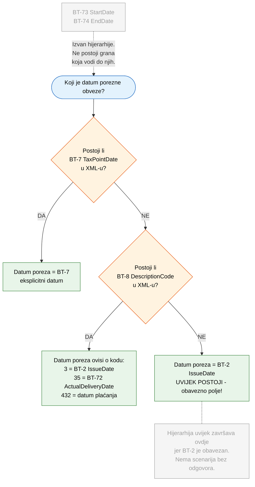
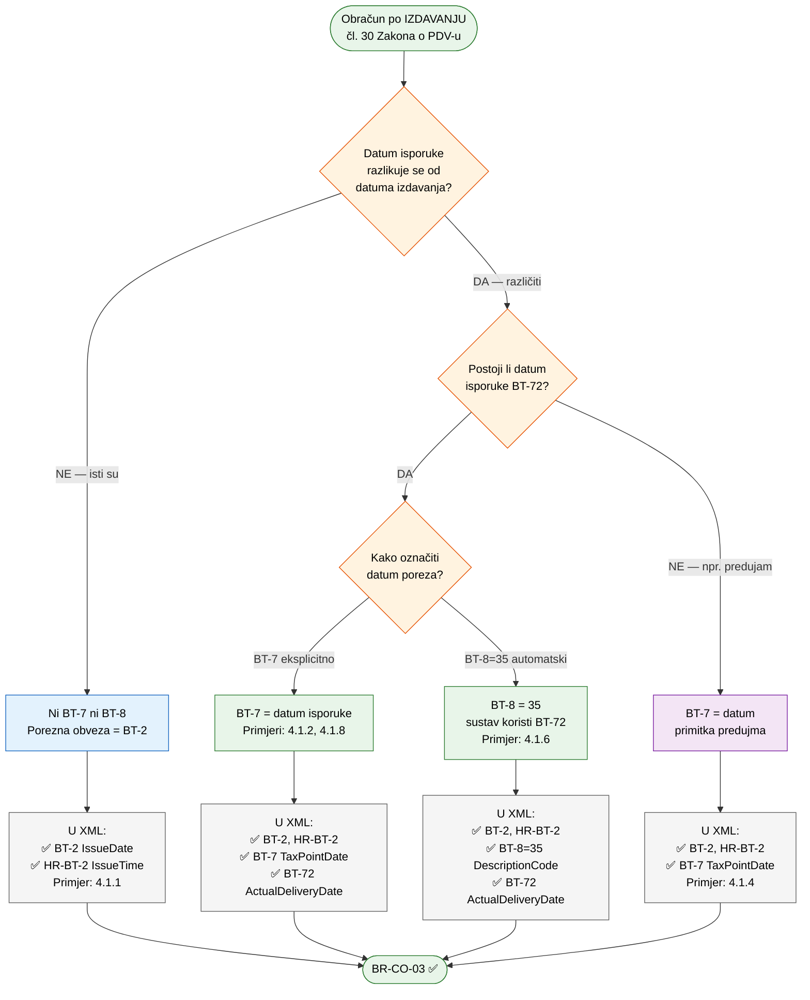
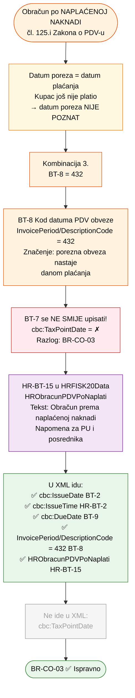

# eRačun — Datumi i porezna obveza (BT-2, BT-7, BT-8, BT-72)

> **HR CIUS 2025 / EN16931 — Specifikacija osnovne uporabe eRačuna s proširenjima**

### Sadržaj
{: .no_toc }

* TOC
{:toc}

---

## 1. Pregled polja

| BT polje | XML element | Hrvatski naziv | Obavezno? | Opis |
|----------|-------------|----------------|-----------|------|
| **BT-2** | `cbc:IssueDate` | Datum izdavanja računa | **DA** | Kada je račun izdan |
| **HR-BT-2** | `cbc:IssueTime` | Vrijeme izdavanja računa | **DA** (HR) | Točno vrijeme izdavanja (hh:mm:ss) |
| **BT-7** | `cbc:TaxPointDate` | Datum nastanka obveze PDV-a | NE | Eksplicitni datum kada nastaje porezna obveza |
| **BT-8** | `cac:InvoicePeriod/cbc:DescriptionCode` | Kod datuma PDV obveze | NE | Kod koji govori KAKO odrediti datum porezne obveze |
| **BT-9** | `cbc:DueDate` | Datum dospijeća plaćanja | NE | Rok do kojeg kupac treba platiti |
| **BT-72** | `cac:Delivery/cbc:ActualDeliveryDate` | Stvarni datum isporuke | NE | Kada je roba isporučena ili usluga obavljena |
| **BT-73** | `cac:InvoicePeriod/cbc:StartDate` | Početak obračunskog razdoblja | NE | Za periodične račune (pretplate, najam...) |
| **BT-74** | `cac:InvoicePeriod/cbc:EndDate` | Kraj obračunskog razdoblja | NE | Za periodične račune (pretplate, najam...) |
| **HR-BT-15** | `hrextac:HRObracunPDVPoNaplati` | Obračun prema naplaćenoj naknadi | NE | Oznaka u HRFISK20Data bloku za čl. 125.i |

---

## 2. Ključno pravilo: BR-CO-03

> **BR-CO-03**: Europska norma EN16931 propisuje da se **BT-7** i **BT-8** **međusobno isključuju**.
>
> - **BT-7** / Datum nastanka obveze PDV-a (`cbc:TaxPointDate`) — eksplicitni datum
> - **BT-8** / Kod datuma PDV obveze (`cac:InvoicePeriod/cbc:DescriptionCode`) — kod koji upućuje na drugi podatak
>
> Oba služe istoj svrsi: definiranju kada nastaje obveza PDV-a. Ako bi oba bila prisutna,
> sustav ne bi znao koji ima prednost. Ovo pravilo je **`flag="fatal"`** u Schematron validatoru
> — račun koji sadrži oba polja bit će **odbijen**.

### Dozvoljene kombinacije prisutnosti polja u XML dokumentu

| | BT-7 | BT-8 | Rezultat | Kako se određuje datum porezne obveze |
|:---:|:---:|:---:|:---:|:---|
| 1. | — | — | **Ispravno** | Porezna obveza = BT-2 / Datum izdavanja (`cbc:IssueDate`). **Najčešći slučaj.** |
| 2. | **DA** | — | **Ispravno** | Porezna obveza = eksplicitni datum u BT-7 (`cbc:TaxPointDate`) |
| 3. | — | **DA** | **Ispravno** | Porezna obveza se određuje prema kodu u BT-8 (vidi sekciju 3) |
| 4. | **DA** | **DA** | **GREŠKA!** | Schematron validator **ODBIJA** račun (BR-CO-03) |

### Što određuje datum poreza, a što NE

> **Datum nastanka porezne obveze** uvijek određuje isključivo:
> 1. **BT-7** (`cbc:TaxPointDate`) — eksplicitni datum, ili
> 2. **BT-8** (`cbc:DescriptionCode`) — kod koji upućuje na drugi datum, ili
> 3. **BT-2** (`cbc:IssueDate`) — default ako nema ni BT-7 ni BT-8
>
> **BT-73 / Početak obračunskog razdoblja (`cbc:StartDate`) i BT-74 / Kraj obračunskog
> razdoblja (`cbc:EndDate`) NIKADA ne utječu na datum nastanka porezne obveze.**
> Oni su uvijek isključivo informativni — govore primatelju računa za koje vremensko
> razdoblje se račun odnosi (npr. "najam za siječanj–ožujak").
>
> Razlog: datum porezne obveze se **uvijek** određuje kroz gornja tri polja po sljedećoj
> hijerarhiji. Ključno je da **BT-2 (IssueDate) uvijek postoji** — to je obavezno polje
> (HR-BR-40). Zato hijerarhija uvijek ima odgovor i nikada ne može doći u stanje
> "nema datuma poreza" — što znači da BT-73/BT-74 nikada ne mogu doći na red
> kao zamjena. Oni su isključivo informativni i mogu se dodati u bilo koji račun
> bez ikakve promjene u PDV tretmanu.



### Brojčanik računa i BT-2 (IssueDate)

> Redni broj računa (brojčanik) uvijek se vrti prema **BT-2 / Datum izdavanja računa
> (`cbc:IssueDate`)**, bez obzira na koje se porezno razdoblje račun odnosi.
>
> Primjer: IT podrška obavljena u prosincu 2025., račun izdan 10.01.2026.
> - Broj računa: **1/1/1** (prvi račun u 2026. godini)
> - BT-2 (`cbc:IssueDate`): 2026-01-10
> - Datum nastanka porezne obveze: 2025-12-31 (određen kroz BT-7 ili BT-8, ovisno o situaciji)
>
> Brojčanik pripada **2026.** (po datumu izdavanja), iako PDV ide u **2025.**
> (po datumu nastanka porezne obveze). Ovo je u skladu sa Zakonom o fiskalizaciji
> (čl. 8 i 9) — broj računa prati kronološki redoslijed izdavanja, ne porezno razdoblje.

---

### Slučaj 1: Obračun po izdavanju (čl. 30 Zakona o PDV-u)

> *"Oporezivi događaj i obveza obračuna PDV-a nastaju kada su dobra isporučena ili usluge obavljene."*
> — Čl. 30, st. 1 Zakona o PDV-u
>
> Datum poreza je poznat u trenutku izdavanja računa i jednak je **datumu isporuke**.



> **Primjer**: Roba isporučena 28.03., račun izdan 05.04.
> BT-7 (`cbc:TaxPointDate`) = 2026-03-28 → PDV ulazi u **ožujak**, ne u travanj.
>
> **Standardni slučajevi** (pokriveni dijagramom): [4.1.1 Isti dan](#411-isporuka-i-račun-isti-dan-po-izdavanju), [4.1.2 Drugi mjesec](#412-isporuka-u-drugom-mjesecu-od-računa-po-izdavanju), [4.1.4 Predujam](#414-predujam-avansni-račun-čl-30-st-5-po-izdavanju), [4.1.6 BT-8=35](#416-bt-835--automatska-veza-na-datum-isporuke-po-izdavanju), [4.1.8 Svi datumi različiti](#418-svi-datumi-u-različitim-mjesecima--bt-7-eksplicitni-datum-po-izdavanju)
>
> **Specijalni slučajevi** (nisu u dijagramu, detaljno razrađeni u primjerima): [4.1.3 Račun prije isporuke](#413-račun-izdan-prije-isporuke-čl-30-st-2-po-izdavanju) (čl. 30 st. 2 — PDV po datumu računa, ne isporuke), [4.1.5 Kontinuirana usluga](#415-kontinuirana-usluga--obračunsko-razdoblje-bt-73-bt-74-po-izdavanju) (BT-7 = kraj razdoblja, nema BT-72), [4.1.7 Odobrenje](#417-odobrenje--creditnote-po-izdavanju) (BT-7 ne postoji u CreditNote shemi)

---

### Slučaj 2: Obračun po naplaćenoj naknadi (čl. 125.i Zakona o PDV-u)

> *"Porezni obveznik koji primjenjuje postupak oporezivanja prema naplaćenim naknadama,*
> *obvezu obračuna PDV-a ima u trenutku primitka plaćanja."*
> — Čl. 125.i Zakona o PDV-u
>
> Datum poreza u trenutku izdavanja računa **nije poznat** — ovisi o tome kada će kupac platiti.



> **Primjer**: Račun izdan 15.03., roba isporučena 10.03., kupac plaća 20.05.
> PDV obveza nastaje tek **20.05.** kada kupac plati.
> Na ispisu računa polje "Datum poreza" je **skriveno** jer datum još nije poznat.
>
> **HR-BT-15 napomena**: Posrednik iz elementa `hrextac:HRObracunPDVPoNaplati`
> (s tekstom *"Obračun prema naplaćenoj naknadi"*) generira SOAP poruku za
> `EvidentirajERacun` prema Poreznoj upravi, koja označava da se za ovaj račun
> primjenjuje postupak oporezivanja prema naplaćenim naknadama (čl. 125.i Zakona o PDV-u).
>
> XML primjeri za ovaj slučaj: [4.2.1 Isti mjesec](#421-isporuka-i-račun-isti-mjesec-po-naplati), [4.2.2 Drugi mjesec](#422-isporuka-u-drugom-mjesecu-od-računa-po-naplati), [4.2.3 Račun prije isporuke](#423-račun-izdan-prije-isporuke-po-naplati), [4.2.4 Predujam](#424-predujam-avansni-račun-po-naplati), [4.2.5 Kontinuirana](#425-kontinuirana-usluga-s-obračunskim-razdobljem-po-naplati), [4.2.6 Odobrenje](#426-odobrenje-creditnote-po-naplati)

---

## 3. Mogući kodovi za BT-8

| Kod | Značenje | Porezna obveza = | Kada se koristi |
|:---:|----------|------------------|-----------------|
| **3** | Datum izdavanja | BT-2 / Datum izdavanja računa (`cbc:IssueDate`) | Redundantno — isto kao default kad nema ni BT-7 ni BT-8 |
| **35** | Datum isporuke | BT-72 / Stvarni datum isporuke (`cbc:ActualDeliveryDate`) | Kad želimo automatski vezati poreznu obvezu na datum isporuke |
| **432** | Datum plaćanja | Datum kad kupac plati račun | **Obračun po naplaćenoj naknadi (čl. 125.i Zakona o PDV-u)** |

---

## 4. Primjeri iz prakse

<a id="kako-citati-xml"></a>

### Kako čitati XML primjere

U primjerima ispod prikazujemo isječke XML koda eRačuna. Kod je **obojan** za lakše čitanje:

- <span style="color:#569cd6">**Plavo**</span> — nazivi XML elemenata (npr. `cbc:IssueDate`, `cac:InvoicePeriod`)
- **Bijelo** — vrijednosti i tekst (npr. `2026-03-15`, `432`)
- <span style="color:#6a9955">***Zeleno italic***</span> — **komentari** (`<!-- ... -->`) — ovo **NIJE dio XML-a**, služi samo kao objašnjenje za čitatelja. Komentari se ne šalju u stvarnoj XML datoteci.

---

### 4.1 Obračun po izdavanju (čl. 30 Zakona o PDV-u) <span class="badge-izdavanje">Po izdavanju</span>

#### 4.1.1 Isporuka i račun isti dan <span class="badge-izdavanje">Po izdavanju</span>

| Podatak | BT polje | XML element | Vrijednost |
|---------|----------|-------------|-----------|
| Datum izdavanja računa | BT-2 | `cbc:IssueDate` | 2026-03-15 |
| Datum isporuke dobara | BT-72 | `cbc:ActualDeliveryDate` | 2026-03-15 |

```xml
<!-- BT-2: Datum izdavanja računa -->
<!-- BT-7: NEMA — datum isporuke = datum izdavanja -->
<!-- BT-8: NEMA -->
<!-- BT-72: NEMA — datum isporuke = datum izdavanja -->
<cbc:IssueDate>2026-03-15</cbc:IssueDate>
<cbc:IssueTime>14:30:00</cbc:IssueTime>
```
> Porezna obveza: **15.03.2026** (= datum izdavanja, default po čl. 30 st. 1)

---

#### 4.1.2 Isporuka u drugom mjesecu od računa <span class="badge-izdavanje">Po izdavanju</span>

| Podatak | BT polje | XML element | Vrijednost |
|---------|----------|-------------|-----------|
| Datum izdavanja računa | BT-2 | `cbc:IssueDate` | 2026-04-05 |
| Datum isporuke dobara | BT-72 | `cbc:ActualDeliveryDate` | 2026-03-28 |
| Datum nastanka obveze PDV-a | BT-7 | `cbc:TaxPointDate` | 2026-03-28 |

```xml
<!-- BT-2: Datum izdavanja računa -->
<!-- BT-7: Datum nastanka obveze PDV-a = datum isporuke (čl. 30 st. 1) -->
<!-- BT-72: Stvarni datum isporuke -->
<cbc:IssueDate>2026-04-05</cbc:IssueDate>
<cbc:IssueTime>09:15:00</cbc:IssueTime>

<cbc:TaxPointDate>2026-03-28</cbc:TaxPointDate>

<cac:Delivery>
  <cbc:ActualDeliveryDate>2026-03-28</cbc:ActualDeliveryDate>
</cac:Delivery>
```
> Porezna obveza: **28.03.2026** — PDV ulazi u **ožujak**, ne u travanj!
> Razlog: po čl. 30 st. 1 Zakona o PDV-u, obveza nastaje kad su dobra isporučena.

---

#### 4.1.3 Račun izdan prije isporuke (čl. 30 st. 2) <span class="badge-izdavanje">Po izdavanju</span>

> *"Ako je račun izdan prije nego su dobra isporučena ili usluge obavljene,*
> *obveza obračuna PDV-a nastaje na dan izdavanja računa."*
> — Čl. 30, st. 2 Zakona o PDV-u
>
> Ovo je **obrnuta situacija** od Primjera B — račun prethodi isporuci.
> Porezna obveza nastaje **danom izdavanja računa**, ne danom isporuke.

| Podatak | BT polje | XML element | Vrijednost |
|---------|----------|-------------|-----------|
| Datum izdavanja računa | BT-2 | `cbc:IssueDate` | 2026-03-05 |
| Stvarni datum isporuke | BT-72 | `cbc:ActualDeliveryDate` | 2026-03-20 |

```xml
<!-- BT-7: NEMA — porezna obveza = datum izdavanja (čl. 30 st. 2) -->
<!-- BT-8: NEMA — default ponašanje je upravo to što nam treba -->
<!-- BT-72: Isporuka je nakon računa -->
<cbc:IssueDate>2026-03-05</cbc:IssueDate>
<cbc:IssueTime>10:00:00</cbc:IssueTime>

<cac:Delivery>
  <cbc:ActualDeliveryDate>2026-03-20</cbc:ActualDeliveryDate>
</cac:Delivery>
```
> PDV ide u **ožujak** — ali po datumu računa (05.03.), ne po datumu isporuke (20.03.).
> Ne trebamo ni BT-7 ni BT-8 jer default (BT-2) je upravo ono što zakon traži.
> BT-72 je informativan — govori kupcu kad će roba biti isporučena.
>
> **Pozor**: Ako su račun i isporuka u **različitim mjesecima** (npr. račun 28.03., isporuka 05.04.),
> PDV i dalje ide u ožujak (datum računa). Ovo je jedini slučaj gdje datum izdavanja
> ima prednost nad datumom isporuke.

---

#### 4.1.4 Predujam / avansni račun (čl. 30 st. 5) <span class="badge-izdavanje">Po izdavanju</span>

> *"Za primljene predujmove obveza obračuna PDV-a na primljeni iznos*
> *nastaje u trenutku primitka predujma."*
> — Čl. 30, st. 5 Zakona o PDV-u
>
> Kupac plaća unaprijed. Isporuke još nema. Račun za predujam se izdaje nakon primitka uplate.

| Podatak | BT polje | XML element | Vrijednost |
|---------|----------|-------------|-----------|
| Datum izdavanja računa | BT-2 | `cbc:IssueDate` | 2026-02-10 |
| Datum primitka predujma | BT-7 | `cbc:TaxPointDate` | 2026-02-05 |

```xml
<!-- BT-7: Datum primitka predujma — to je datum porezne obveze (čl. 30 st. 5) -->
<!-- BT-72: NEMA — isporuka se još nije dogodila -->
<!-- Vrsta dokumenta: 386 = predujam -->
<cbc:IssueDate>2026-02-10</cbc:IssueDate>
<cbc:IssueTime>08:30:00</cbc:IssueTime>

<cbc:TaxPointDate>2026-02-05</cbc:TaxPointDate>

<cbc:InvoiceTypeCode>386</cbc:InvoiceTypeCode>
```
> PDV ide u **veljaču** — po datumu primitka predujma (05.02.), ne po datumu računa (10.02.).
> BT-72 se ne koristi jer roba/usluga još nije isporučena.
> Vrsta dokumenta je **386** (predujam), ne 380 (standardni račun).
>
> **Važno**: Kod predujma, BT-7 je **datum primitka uplate**, ne datum isporuke.
> Ovo je poseban slučaj čl. 30 st. 5 gdje porezna obveza nastaje
> primanjem novca, a ne isporukom dobara.

---

#### 4.1.5 Kontinuirana usluga — obračunsko razdoblje (BT-73, BT-74) <span class="badge-izdavanje">Po izdavanju</span>

> IT podrška za razdoblje siječanj–ožujak 2026. Račun izdan u travnju.
> Ovo je primjer iz čl. 30 st. 2 Zakona o PDV-u: *"Za kontinuirane isporuke dobara*
> *ili usluge sa stalnim računima, smatra se da su isporučeni po isteku razdoblja*
> *na koje se računi odnose."*
>
> Kod kontinuiranih usluga nema jednog datuma isporuke — porezna obveza nastaje istekom
> razdoblja (čl. 30 st. 2). BT-73/BT-74 opisuju to razdoblje, ali **datum poreza i dalje
> određuje BT-7** koji se postavlja na kraj razdoblja (= BT-74).

| Podatak | BT polje | XML element | Vrijednost |
|---------|----------|-------------|-----------|
| Datum izdavanja računa | BT-2 | `cbc:IssueDate` | 2026-04-05 |
| Početak obračunskog razdoblja | BT-73 | `cbc:StartDate` | 2026-01-01 |
| Kraj obračunskog razdoblja | BT-74 | `cbc:EndDate` | 2026-03-31 |
| Datum nastanka obveze PDV-a | BT-7 | `cbc:TaxPointDate` | 2026-03-31 |

```xml
<!-- BT-7: Datum nastanka obveze PDV-a = kraj obračunskog razdoblja -->
<!-- BT-73/BT-74: Obračunsko razdoblje — informacija o periodu usluge -->
<!-- BT-72: NEMA — kod kontinuiranih usluga nema jednog datuma isporuke -->
<cbc:IssueDate>2026-04-05</cbc:IssueDate>
<cbc:IssueTime>10:00:00</cbc:IssueTime>

<cbc:TaxPointDate>2026-03-31</cbc:TaxPointDate>

<cac:InvoicePeriod>
  <cbc:StartDate>2026-01-01</cbc:StartDate>
  <cbc:EndDate>2026-03-31</cbc:EndDate>
</cac:InvoicePeriod>
```
> PDV ide u **ožujak** — kraj obračunskog razdoblja (čl. 30 st. 2).
> BT-73/BT-74 opisuju razdoblje usluge (siječanj–ožujak).
> BT-7 je eksplicitno postavljen na kraj razdoblja (31.03.) jer tada nastaje porezna obveza.
> BT-72 se ne koristi jer nema jednog datuma isporuke — usluga je kontinuirana.
>
> **Važno**: BT-73 i BT-74 sami po sebi NE određuju datum poreza — oni su informativni.
> Datum poreza i dalje određuje BT-7 (ili BT-8). Ali za kontinuirane usluge, BT-7
> se postavlja na datum koji proizlazi iz čl. 30 st. 2 — kraj razdoblja.

#### 4.1.5a Što ako izostavimo BT-7 kod kontinuirane usluge? <span class="badge-izdavanje">Po izdavanju</span>

> Isti slučaj kao D.4 (IT podrška sij–ožu, račun u travnju), ali **bez BT-7**.

```xml
<!-- BT-7: NEMA! -->
<!-- BT-8: NEMA! -->
<cbc:IssueDate>2026-04-05</cbc:IssueDate>
<cbc:IssueTime>10:00:00</cbc:IssueTime>

<cac:InvoicePeriod>
  <cbc:StartDate>2026-01-01</cbc:StartDate>
  <cbc:EndDate>2026-03-31</cbc:EndDate>
</cac:InvoicePeriod>
```
> Bez BT-7 i BT-8, porezna obveza = BT-2 (datum izdavanja) = **travanj**.
> Ali po čl. 30 st. 2, obveza je nastala istekom razdoblja = **ožujak**.
> **PDV završava u krivom mjesecu!**
>
> BT-73/BT-74 su samo informativni — govore primatelju da se račun odnosi
> na razdoblje sij–ožu, ali sustav ih **ne koristi za određivanje datuma poreza**.
> Bez BT-7 ili BT-8, sustav uvijek uzima BT-2 kao datum porezne obveze.
>
> **Zaključak**: Za kontinuirane usluge BT-7 je **nužan** — bez njega PDV
> ide u mjesec izdavanja računa umjesto u mjesec završetka usluge.

#### 4.1.5b BT-7 različit od kraja razdoblja — je li to ispravno? <span class="badge-izdavanje">Po izdavanju</span>

> Isti slučaj, ali BT-7 postavljen na veljaču umjesto na ožujak.

| Podatak | BT polje | Vrijednost |
|---------|----------|-----------|
| Datum izdavanja računa | BT-2 | 2026-04-05 |
| Početak obračunskog razdoblja | BT-73 | 2026-01-01 |
| Kraj obračunskog razdoblja | BT-74 | 2026-03-31 |
| Datum nastanka obveze PDV-a | BT-7 | **2026-02-15** |

```xml
<cbc:IssueDate>2026-04-05</cbc:IssueDate>
<cbc:TaxPointDate>2026-02-15</cbc:TaxPointDate>
<cac:InvoicePeriod>
  <cbc:StartDate>2026-01-01</cbc:StartDate>
  <cbc:EndDate>2026-03-31</cbc:EndDate>
</cac:InvoicePeriod>
```
> **Schematron validator**: prolazi — HR-BR-48 samo provjerava raspon datuma (1900–2100),
> ne provjerava logičku vezu između BT-7 i BT-73/BT-74.
>
> **Zakonski**: **neispravno** — po čl. 30 st. 2, za kontinuirane usluge porezna obveza
> nastaje istekom razdoblja (ožujak), ne u nekom proizvoljnom mjesecu unutar razdoblja.
> Porezna uprava bi mogla osporiti PDV prijavu jer je PDV prikazan u veljači
> umjesto u ožujku.
>
> **Zaključak**: Validator ne hvata sve zakonske nepravilnosti. Činjenica da XML prolazi
> validaciju ne znači da je porezno ispravan. BT-7 kod kontinuiranih usluga **mora biti
> jednak BT-74** (kraj obračunskog razdoblja) da bi bio usklađen s čl. 30 st. 2.

#### 4.1.6 BT-8=35 — automatska veza na datum isporuke <span class="badge-izdavanje">Po izdavanju</span>

> Umjesto da eksplicitno upišemo datum u BT-7, kažemo sustavu:
> "datum porezne obveze = datum isporuke (BT-72)".
> Rezultat je isti kao D.1, ali mehanizam je drugačiji.

```xml
<!-- BT-7: NEMA — koristimo BT-8 umjesto eksplicitnog datuma -->
<!-- BT-8 = 35: porezna obveza = BT-72 ActualDeliveryDate -->
<!-- BT-72: Stvarni datum isporuke — sustav automatski koristi ovaj datum za PDV -->
<cbc:IssueDate>2026-03-10</cbc:IssueDate>
<cbc:IssueTime>09:00:00</cbc:IssueTime>

<cac:InvoicePeriod>
  <cbc:DescriptionCode>35</cbc:DescriptionCode>
</cac:InvoicePeriod>

<cac:Delivery>
  <cbc:ActualDeliveryDate>2026-01-25</cbc:ActualDeliveryDate>
</cac:Delivery>
```
> PDV ide u **siječanj** — isti rezultat kao D.1.
> Razlika: BT-7 eksplicitno piše datum, BT-8=35 govori sustavu "pogledaj BT-72".
> Prednost BT-8=35: garantira konzistentnost — nema rizika da BT-7 i BT-72 budu različiti.
> Nedostatak: ne možemo odvojiti datum poreza od datuma isporuke (vidi D.4).

#### 4.1.7 Odobrenje / CreditNote <span class="badge-izdavanje">Po izdavanju</span>

> Odobrenje (knjižno odobrenje) umanjuje iznos prethodno izdanog računa.
> U UBL CreditNote shemi **BT-7 (`cbc:TaxPointDate`) ne postoji**.

| Podatak | BT polje | XML element | Vrijednost |
|---------|----------|-------------|-----------|
| Datum izdavanja odobrenja | BT-2 | `cbc:IssueDate` | 2026-04-10 |
| Referenca na izvorni račun | BT-25 | `cbc:ID` (BillingReference) | 147/1/1 |
| Datum izvornog računa | BT-26 | `cbc:IssueDate` (BillingReference) | 2026-03-15 |

```xml
<!-- Korijen: CreditNote, NE Invoice -->
<!-- BT-7: NE POSTOJI u CreditNote shemi! -->
<!-- Vrsta dokumenta: 381 = odobrenje -->
<!-- BT-25/BT-26: Referenca na izvorni račun -->
<CreditNote>
  <cbc:IssueDate>2026-04-10</cbc:IssueDate>
  <cbc:IssueTime>12:00:00</cbc:IssueTime>

  <cbc:CreditNoteTypeCode>381</cbc:CreditNoteTypeCode>

  <cac:BillingReference>
    <cac:InvoiceDocumentReference>
      <cbc:ID>147/1/1</cbc:ID>
      <cbc:IssueDate>2026-03-15</cbc:IssueDate>
    </cac:InvoiceDocumentReference>
  </cac:BillingReference>
</CreditNote>
```
> PDV korekcija ide u **travanj** (datum izdavanja odobrenja).
> BT-7 ne postoji u UBL CreditNote shemi — nema mogućnosti eksplicitnog datuma poreza.
> BT-8 se također ne koristi za odobrenja.
> Referenca na izvorni račun (BT-25/BT-26) povezuje odobrenje s originalnim računom.
>
> **Napomena**: U praksi, knjigovođa odlučuje u koje porezno razdoblje ulazi
> korekcija PDV-a — to ovisi o internim pravilima i nije definirano XML-om.

---


#### 4.1.8 Svi datumi u različitim mjesecima — BT-7 eksplicitni datum <span class="badge-izdavanje">Po izdavanju</span>

> Isporuka je bila u siječnju → porezna obveza nastala u siječnju.
> BT-7 eksplicitno upisuje datum isporuke kao datum porezne obveze.

```xml
<!-- BT-7: Eksplicitni datum nastanka obveze PDV-a = datum isporuke -->
<!-- BT-72: Stvarni datum isporuke -->
<cbc:IssueDate>2026-03-10</cbc:IssueDate>
<cbc:IssueTime>09:00:00</cbc:IssueTime>

<cbc:TaxPointDate>2026-01-25</cbc:TaxPointDate>

<cac:Delivery>
  <cbc:ActualDeliveryDate>2026-01-25</cbc:ActualDeliveryDate>
</cac:Delivery>
```
> PDV ide u **siječanj**. BT-7 i BT-72 imaju isti datum jer je
> porezna obveza vezana za isporuku (čl. 30 st. 1).

### 4.2 Obračun po naplaćenoj naknadi (čl. 125.i Zakona o PDV-u) <span class="badge-naplata">Po naplati</span>

#### 4.2.1 Isporuka i račun isti mjesec <span class="badge-naplata">Po naplati</span>

| Podatak | BT polje | XML element | Vrijednost |
|---------|----------|-------------|-----------|
| Datum izdavanja računa | BT-2 | `cbc:IssueDate` | 2026-03-15 |
| Stvarni datum isporuke | BT-72 | `cbc:ActualDeliveryDate` | 2026-03-10 |
| Kod datuma PDV obveze | BT-8 | `cbc:DescriptionCode` | 432 |
| Datum plaćanja | — | — | nije poznat u trenutku izdavanja |

```xml
<!-- BT-2: Datum izdavanja -->
<!-- BT-7: NEMA! (BR-CO-03 — ne smije biti uz BT-8) -->
<!-- BT-8 = 432: Porezna obveza nastaje danom plaćanja -->
<!-- BT-72: Datum isporuke -->
<!-- HR-BT-15: U HRFISK20Data bloku -->
<!-- ... ostali HR podaci ... -->
<cbc:IssueDate>2026-03-15</cbc:IssueDate>
<cbc:IssueTime>11:00:00</cbc:IssueTime>

<cac:InvoicePeriod>
  <cbc:DescriptionCode>432</cbc:DescriptionCode>
</cac:InvoicePeriod>

<cac:Delivery>
  <cbc:ActualDeliveryDate>2026-03-10</cbc:ActualDeliveryDate>
</cac:Delivery>

<ext:UBLExtensions>
  <ext:UBLExtension>
    <ext:ExtensionContent>
      <hrextac:HRFISK20Data>
        <hrextac:HRObracunPDVPoNaplati>
          Obračun prema naplaćenoj naknadi
        </hrextac:HRObracunPDVPoNaplati>
      </hrextac:HRFISK20Data>
    </ext:ExtensionContent>
  </ext:UBLExtension>
</ext:UBLExtensions>
```
> Porezna obveza: **nepoznata** — nastat će tek kada kupac plati račun

---

#### 4.2.2 Isporuka u drugom mjesecu od računa <span class="badge-naplata">Po naplati</span>

> Isti podaci, ali obveznik koristi obračun po naplaćenoj naknadi.
> Ni isporuka ni izdavanje ne određuju datum poreza — samo plaćanje.

```xml
<!-- BT-7: NEMA — datum poreza nije poznat (BR-CO-03) -->
<!-- BT-8 = 432: porezna obveza nastaje danom plaćanja -->
<!-- BT-72: Stvarni datum isporuke — informativan, NE utječe na PDV -->
<cbc:IssueDate>2026-03-10</cbc:IssueDate>
<cbc:IssueTime>09:00:00</cbc:IssueTime>

<cac:InvoicePeriod>
  <cbc:DescriptionCode>432</cbc:DescriptionCode>
</cac:InvoicePeriod>

<cac:Delivery>
  <cbc:ActualDeliveryDate>2026-01-25</cbc:ActualDeliveryDate>
</cac:Delivery>

<!-- HR-BT-15: Obavezno za obračun po naplaćenoj naknadi -->
<ext:UBLExtensions>
  <ext:UBLExtension>
    <ext:ExtensionContent>
      <hrextac:HRFISK20Data>
        <hrextac:HRObracunPDVPoNaplati>
          Obračun prema naplaćenoj naknadi
        </hrextac:HRObracunPDVPoNaplati>
      </hrextac:HRFISK20Data>
    </ext:ExtensionContent>
  </ext:UBLExtension>
</ext:UBLExtensions>
```
> PDV ide u **travanj** — obveza nastaje tek plaćanjem 15.04.
> BT-72 (siječanj) je samo informativan za kupca.
> BT-2 (ožujak) je samo administrativni datum izdavanja.
> Ni jedan ni drugi ne utječe na poreznu obvezu.

#### 4.2.3 Račun izdan prije isporuke <span class="badge-naplata">Po naplati</span>

> Račun izdan 05.03., isporuka planirana 20.03., kupac plaća 10.04.
> Kod obračuna po naplati, niti datum računa niti datum isporuke ne igraju ulogu — PDV nastaje isključivo plaćanjem.

| Podatak | BT polje | XML element | Vrijednost |
|---------|----------|-------------|-----------|
| Datum izdavanja računa | BT-2 | `cbc:IssueDate` | 2026-03-05 |
| Stvarni datum isporuke | BT-72 | `cbc:ActualDeliveryDate` | 2026-03-20 |
| Kod datuma PDV obveze | BT-8 | `cbc:DescriptionCode` | 432 |

```xml
<!-- BT-7: NEMA (BR-CO-03) -->
<!-- BT-8 = 432: porezna obveza nastaje danom plaćanja -->
<!-- BT-72: informativan — ne utječe na PDV -->
<cbc:IssueDate>2026-03-05</cbc:IssueDate>
<cbc:IssueTime>10:00:00</cbc:IssueTime>

<cac:InvoicePeriod>
  <cbc:DescriptionCode>432</cbc:DescriptionCode>
</cac:InvoicePeriod>

<cac:Delivery>
  <cbc:ActualDeliveryDate>2026-03-20</cbc:ActualDeliveryDate>
</cac:Delivery>

<!-- HR-BT-15: Obavezno za obračun po naplaćenoj naknadi -->
<ext:UBLExtensions>
  <ext:UBLExtension>
    <ext:ExtensionContent>
      <hrextac:HRFISK20Data>
        <hrextac:HRObracunPDVPoNaplati>
          Obračun prema naplaćenoj naknadi
        </hrextac:HRObracunPDVPoNaplati>
      </hrextac:HRFISK20Data>
    </ext:ExtensionContent>
  </ext:UBLExtension>
</ext:UBLExtensions>
```
> PDV ide u **travanj** — obveza nastaje plaćanjem 10.04. (čl. 125.i).
> Za razliku od obračuna po izdavanju (4.1.3) gdje bi PDV išao u ožujak po datumu računa,
> ovdje čak i datum računa ne igra ulogu.

#### 4.2.4 Predujam / avansni račun <span class="badge-naplata">Po naplati</span>

> Kupac plaća unaprijed 05.02., račun za predujam izdan 10.02., isporuke još nema.
> Kod obračuna po naplati, predujam je poseban slučaj: kupac je **već platio** — dakle PDV obveza nastaje **odmah** pri primitku predujma, jednako kao kod obračuna po izdavanju (čl. 30 st. 5).

| Podatak | BT polje | XML element | Vrijednost |
|---------|----------|-------------|-----------|
| Datum izdavanja računa | BT-2 | `cbc:IssueDate` | 2026-02-10 |
| Datum primitka predujma/plaćanja | BT-7 | `cbc:TaxPointDate` | 2026-02-05 |

```xml
<!-- BT-7: datum primitka predujma = datum plaćanja = datum porezne obveze -->
<!-- BT-8: NEMA — koristimo BT-7 jer je datum plaćanja poznat -->
<!-- BT-72: NEMA — isporuka se još nije dogodila -->
<cbc:IssueDate>2026-02-10</cbc:IssueDate>
<cbc:IssueTime>08:30:00</cbc:IssueTime>

<cbc:TaxPointDate>2026-02-05</cbc:TaxPointDate>

<cbc:InvoiceTypeCode>386</cbc:InvoiceTypeCode>

<!-- HR-BT-15: Obavezno — obveznik koristi obračun po naplaćenoj naknadi -->
<ext:UBLExtensions>
  <ext:UBLExtension>
    <ext:ExtensionContent>
      <hrextac:HRFISK20Data>
        <hrextac:HRObracunPDVPoNaplati>
          Obračun prema naplaćenoj naknadi
        </hrextac:HRObracunPDVPoNaplati>
      </hrextac:HRFISK20Data>
    </ext:ExtensionContent>
  </ext:UBLExtension>
</ext:UBLExtensions>
```
> PDV ide u **veljaču** — predujam je primljen 05.02. (čl. 30 st. 5).
> Ovo je jedini slučaj kod obračuna po naplati gdje koristimo **BT-7 umjesto BT-8** — jer je datum plaćanja poznat (kupac je već platio), pa nema smisla stavljati BT-8=432 ("datum plaćanja će se odrediti u budućnosti").
>
> **HR-BT-15 je i dalje obavezan** — iako koristimo BT-7 umjesto BT-8, obveznik je registriran za obračun po naplaćenoj naknadi i ta informacija mora biti u HRFISK20Data bloku za fiskalizacijsku poruku prema Poreznoj upravi.
>
> **Zaključak**: Predujam kod obračuna po naplati koristi BT-7 (jer je datum plaćanja poznat), ali HR-BT-15 ostaje obavezan jer je to svojstvo obveznika, ne pojedinačnog računa.

#### 4.2.5 Kontinuirana usluga s obračunskim razdobljem <span class="badge-naplata">Po naplati</span>

> IT podrška za razdoblje siječanj–ožujak, račun u travnju, kupac plaća u lipnju.
> Obveznik koristi obračun po naplaćenoj naknadi (čl. 125.i).

```xml
<!-- BT-7: NEMA — jer koristimo BT-8 (BR-CO-03) -->
<!-- BT-8 = 432 + BT-73/BT-74 zajedno u InvoicePeriod -->
<cbc:IssueDate>2026-04-05</cbc:IssueDate>
<cbc:IssueTime>10:00:00</cbc:IssueTime>

<cac:InvoicePeriod>
  <cbc:StartDate>2026-01-01</cbc:StartDate>
  <cbc:EndDate>2026-03-31</cbc:EndDate>
  <cbc:DescriptionCode>432</cbc:DescriptionCode>
</cac:InvoicePeriod>

<!-- HR-BT-15: Obavezno za obračun po naplaćenoj naknadi -->
<ext:UBLExtensions>
  <ext:UBLExtension>
    <ext:ExtensionContent>
      <hrextac:HRFISK20Data>
        <hrextac:HRObracunPDVPoNaplati>
          Obračun prema naplaćenoj naknadi
        </hrextac:HRObracunPDVPoNaplati>
      </hrextac:HRFISK20Data>
    </ext:ExtensionContent>
  </ext:UBLExtension>
</ext:UBLExtensions>
```
> PDV ide u **lipanj** — obveza nastaje tek plaćanjem (čl. 125.i).
> BT-73/BT-74 (sij–ožu) govore kupcu za koje razdoblje je račun.
> BT-8=432 govori sustavu da datum poreza ovisi o plaćanju.
> Sve tri informacije (razdoblje, način obračuna, datum plaćanja) su neovisne.
>
> **Važno**: BT-8 (DescriptionCode) i BT-73/BT-74 (StartDate/EndDate) mogu
> koegzistirati unutar istog `cac:InvoicePeriod` elementa — nisu međusobno isključivi.
> Međusobno isključivi su samo BT-7 i BT-8 (pravilo BR-CO-03).

#### 4.2.6 Odobrenje / CreditNote <span class="badge-naplata">Po naplati</span>

> Odobrenje za obveznika koji koristi obračun po naplaćenoj naknadi.
> Odobrenje umanjuje iznos prethodno izdanog računa 147/1/1 od 15.03.2026.

| Podatak | BT polje | XML element | Vrijednost |
|---------|----------|-------------|-----------|
| Datum izdavanja odobrenja | BT-2 | `cbc:IssueDate` | 2026-04-10 |
| Referenca na izvorni račun | BT-25 | `cbc:ID` (BillingReference) | 147/1/1 |
| Datum izvornog računa | BT-26 | `cbc:IssueDate` (BillingReference) | 2026-03-15 |

```xml
<!-- BT-7: NE POSTOJI u CreditNote shemi -->
<!-- Korijen: CreditNote, NE Invoice -->
<CreditNote>
  <cbc:IssueDate>2026-04-10</cbc:IssueDate>
  <cbc:IssueTime>12:00:00</cbc:IssueTime>

  <cbc:CreditNoteTypeCode>381</cbc:CreditNoteTypeCode>

  <cac:BillingReference>
    <cac:InvoiceDocumentReference>
      <cbc:ID>147/1/1</cbc:ID>
      <cbc:IssueDate>2026-03-15</cbc:IssueDate>
    </cac:InvoiceDocumentReference>
  </cac:BillingReference>

  <!-- HR-BT-15: Obavezno — obveznik koristi obračun po naplaćenoj naknadi -->
  <ext:UBLExtensions>
    <ext:UBLExtension>
      <ext:ExtensionContent>
        <hrextac:HRFISK20Data>
          <hrextac:HRObracunPDVPoNaplati>
            Obračun prema naplaćenoj naknadi
          </hrextac:HRObracunPDVPoNaplati>
        </hrextac:HRFISK20Data>
      </ext:ExtensionContent>
    </ext:UBLExtension>
  </ext:UBLExtensions>
</CreditNote>
```
> BT-7 ne postoji u UBL CreditNote shemi, ali **HR-BT-15 je obavezan** jer je obveznik
> registriran za obračun po naplaćenoj naknadi. `UBLExtensions` blok postoji i u CreditNote
> shemi — schematron pravila koriste `//` xpath koji pokriva i Invoice i CreditNote.
>
> Za razliku od primjera 4.1.7 (CreditNote po izdavanju) koji nema HR-BT-15,
> ovdje ga **moramo uključiti** jer posrednik iz njega generira fiskalizacijsku poruku
> s oznakom obračuna po naplaćenoj naknadi.

### 4.3 Usporedba svih mehanizama za isti poslovni slučaj <span class="badge-usporedba">Usporedba</span>

> Pregled: roba isporučena 25.01., račun izdan 10.03., kupac plaća 15.04.

| Mehanizam | Obračun | BT-7 | BT-8 | BT-72 | PDV u mjesecu | Zakonski temelj |
|-----------|---------|:----:|:----:|:-----:|:-------------:|-----------------|
| **Ni BT-7 ni BT-8** | <span class="badge-izdavanje">Po izdavanju</span> | — | — | 25.01. | **Ožujak** (datum računa) | Default |
| **BT-7 eksplicitno** | <span class="badge-izdavanje">Po izdavanju</span> | 25.01. | — | 25.01. | **Siječanj** (datum isporuke) | Čl. 30, st. 1 |
| **BT-8 = 35** | <span class="badge-izdavanje">Po izdavanju</span> | — | 35 | 25.01. | **Siječanj** (= BT-72) | Čl. 30, st. 1 |
| **BT-8 = 432** | <span class="badge-naplata">Po naplati</span> | — | 432 | 25.01. | **Travanj** (datum plaćanja) | Čl. 125.i |
| **BT-8 = 3** | <span class="badge-izdavanje">Po izdavanju</span> | — | 3 | 25.01. | **Ožujak** (= BT-2) | Redundantno |

> Ista roba, isti datumi — pet različitih PDV tretmana ovisno o odabiru BT-7/BT-8.
> U praksi se za jednokratne isporuke koristi BT-7 (eksplicitno), a BT-8=432 za obračun po naplati.
> BT-8=35 je alternativa BT-7 koja garantira konzistentnost s BT-72.
> BT-8=3 je redundantan (isto kao default) i u praksi se ne koristi.

---

## 5. Datumi na eRačunu vs. datumi u knjigovodstvu

> **Česta zabuna**: Datumi na eRačunu (BT-2, BT-7, BT-8, BT-72) služe **isključivo za PDV**.
> Oni NE određuju kada se nešto priznaje kao rashod/trošak u poslovnim knjigama.
> To su dva odvojena pitanja koja se rješavaju po različitim propisima.

Primjer: IT podrška obavljena u prosincu 2025., račun izdan u siječnju 2026., plaćen u veljači 2026.

**Ako prodavatelj koristi obračun po izdavanju (čl. 30):** <span class="badge-izdavanje">Po izdavanju</span>

| Pitanje | Odgovor | Razdoblje | Propis |
|---------|---------|-----------|--------|
| Kad se **priznaje rashod** (trošak)? | Kad je usluga obavljena | **Prosinac 2025.** | HSFI 16, načelo nastanka događaja |
| Kad nastaje **obveza PDV-a** izdavatelju? | Kad je usluga obavljena | **Prosinac 2025.** (BT-7) | Čl. 30, st. 1 Zakona o PDV-u |
| Kad kupac ima **pravo na pretporez**? | Kad primi račun i kad je nastala obveza PDV-a | **Siječanj 2026.** | Čl. 58 Zakona o PDV-u |
| Kad se rashod priznaje za **porez na dobit**? | U godini kad je nastao | **2025.** | Čl. 5 i 11 Zakona o porezu na dobit |

**Ako prodavatelj koristi obračun po naplaćenoj naknadi (čl. 125.i):** <span class="badge-naplata">Po naplati</span>

| Pitanje | Odgovor | Razdoblje | Propis |
|---------|---------|-----------|--------|
| Kad se **priznaje rashod** (trošak)? | Kad je usluga obavljena | **Prosinac 2025.** | HSFI 16, načelo nastanka događaja |
| Kad nastaje **obveza PDV-a** izdavatelju? | Kad kupac plati | **Veljača 2026.** (BT-8=432) | Čl. 125.i Zakona o PDV-u |
| Kad kupac ima **pravo na pretporez**? | Tek kad plati račun | **Veljača 2026.** | Čl. 125.i, st. 3 Zakona o PDV-u |
| Kad se rashod priznaje za **porez na dobit**? | U godini kad je nastao | **2025.** | Čl. 5 i 11 Zakona o porezu na dobit |

> **Ključna razlika**: Kad prodavatelj koristi obračun po naplati, kupac **ne smije odbiti
> pretporez pri primitku računa** — mora čekati do plaćanja. PDV obveza prodavatelja i
> pravo na pretporez kupca nastaju u istom trenutku: danom plaćanja.

> Svih pet stavki mogu biti u **različitim mjesecima ili čak godinama** za isti poslovni događaj.
>
> Kad knjigovođa kaže *"ide u trošak za prošlu godinu"* — misli da je usluga obavljena u
> prošloj godini pa rashod pripada tamo (HSFI 16), čak i ako je račun stigao u siječnju
> nove godine. To se zove **vremensko razgraničenje** i rješava se interno u
> knjigovodstvu, ne kroz eRačun XML.
>
> **eRačun datumi služe za PDV, ne za priznavanje rashoda.**

---

## 6. XML struktura — pozicija elemenata

Redoslijed elemenata u UBL Invoice XML-u je strogo definiran shemom:

```xml
<!-- 1. Zaglavlje -->
<!-- 2. Datumi -->
<!-- 3. Reference -->
<!-- 4. InvoicePeriod (ako se koristi BT-8) -->
<!-- ... narudžbe, reference ... -->
<!-- 5. Isporuka -->
<!-- ... stavke, porezi, iznosi ... -->
<Invoice>
  <cbc:CustomizationID>urn:cen.eu:en16931:2017#compliant#urn:mfin.gov.hr:cius-2025:1.0...</cbc:CustomizationID>
  <cbc:ProfileID>P1</cbc:ProfileID>
  <cbc:ID>2026-001-00001</cbc:ID>

  <cbc:IssueDate>2026-03-15</cbc:IssueDate>          <!-- BT-2:  OBAVEZNO -->
  <cbc:IssueTime>14:30:00</cbc:IssueTime>             <!-- HR-BT-2: OBAVEZNO (HR) -->
  <cbc:DueDate>2026-04-14</cbc:DueDate>               <!-- BT-9:  Rok plaćanja -->
  <cbc:InvoiceTypeCode>380</cbc:InvoiceTypeCode>
  <cbc:Note>...</cbc:Note>
  <cbc:TaxPointDate>2026-03-10</cbc:TaxPointDate>     <!-- BT-7:  OPCIONALNO, NE uz BT-8! -->
  <cbc:DocumentCurrencyCode>EUR</cbc:DocumentCurrencyCode>

  <cbc:BuyerReference>...</cbc:BuyerReference>

  <cac:InvoicePeriod>
    <cbc:StartDate>2026-01-01</cbc:StartDate>          <!-- BT-73: opcionalno -->
    <cbc:EndDate>2026-06-30</cbc:EndDate>              <!-- BT-74: opcionalno -->
    <cbc:DescriptionCode>432</cbc:DescriptionCode>     <!-- BT-8:  NE uz BT-7! -->
  </cac:InvoicePeriod>

  <cac:Delivery>
    <cbc:ActualDeliveryDate>2026-03-10</cbc:ActualDeliveryDate>  <!-- BT-72 -->
  </cac:Delivery>

</Invoice>
```

---

## 7. Validacijska pravila za datume (Schematron)

> Sva pravila u tablici ispod su **`flag="fatal"`** — ako ih račun ne zadovolji,
> **Schematron validator odbija XML** i račun se ne može poslati posredniku.
> Pravila s prefiksom **HR-BR** dolaze iz HR CIUS 2025 schematrona (`HR-CIUS-EXT-EN16931-UBL.sch`),
> a pravila s prefiksom **BR-CO** iz europskog EN16931 schematrona (`EN16931-UBL-validation.xslt`).

| Pravilo | Izvor | Opis | Primjenjuje se na |
|---------|-------|------|-------------------|
| **HR-BR-2** | HR CIUS 2025 | Račun MORA imati HR-BT-2 / Vrijeme izdavanja (`cbc:IssueTime`) u formatu hh:mm:ss | `cbc:IssueTime` |
| **HR-BR-40** | HR CIUS 2025 | BT-2 / Datum izdavanja (`cbc:IssueDate`) mora biti >= 01.01.2026 i < 01.01.2100 | `cbc:IssueDate` |
| **HR-BR-41** | HR CIUS 2025 | BT-9 / Datum dospijeća (`cbc:DueDate`) mora biti >= 01.01.1900 i < 01.01.2100 | `cbc:DueDate` |
| **HR-BR-44** | HR CIUS 2025 | BT-72 / Stvarni datum isporuke (`cbc:ActualDeliveryDate`) mora biti >= 01.01.1900 i < 01.01.2100 | `cbc:ActualDeliveryDate` |
| **HR-BR-48** | HR CIUS 2025 | BT-7 / Datum nastanka obveze PDV-a (`cbc:TaxPointDate`) mora biti >= 01.01.1900 i < 01.01.2100 | `cbc:TaxPointDate` |
| **HR-BR-49** | HR CIUS 2025 | BT-73 / Početak obračunskog razdoblja (`cbc:StartDate`) mora biti >= 01.01.1900 i < 01.01.2100 | `cac:InvoicePeriod/cbc:StartDate` |
| **HR-BR-50** | HR CIUS 2025 | BT-74 / Kraj obračunskog razdoblja (`cbc:EndDate`) mora biti >= 01.01.1900 i < 01.01.2100 | `cac:InvoicePeriod/cbc:EndDate` |
| **BR-CO-03** | EN16931 | BT-7 / Datum nastanka obveze PDV-a (`cbc:TaxPointDate`) i BT-8 / Kod datuma PDV obveze (`cbc:DescriptionCode`) su međusobno isključivi | `cbc:TaxPointDate` vs `cac:InvoicePeriod/cbc:DescriptionCode` |

---

## 8. Zakonski temelj

| Propis | Članak | Relevantnost | Službeni izvor |
|--------|--------|-------------|----------------|
| **Zakon o PDV-u** | Čl. 30, st. 1 | "Oporezivi događaj i obveza obračuna PDV-a nastaju kada su dobra isporučena ili usluge obavljene." | <a href="https://narodne-novine.nn.hr/clanci/sluzbeni/2013_06_73_1451.html" target="_blank">NN 73/13</a> |
| **Zakon o PDV-u** | Čl. 30, st. 2 | Za kontinuirane isporuke, smatra se da su isporučeni po isteku razdoblja na koje se računi odnose | <a href="https://narodne-novine.nn.hr/clanci/sluzbeni/2013_06_73_1451.html" target="_blank">NN 73/13</a> |
| **Zakon o PDV-u** | Čl. 30, st. 5 | "Za primljene predujmove obveza obračuna PDV-a nastaje u trenutku primitka predujma." | <a href="https://narodne-novine.nn.hr/clanci/sluzbeni/2013_06_73_1451.html" target="_blank">NN 73/13</a> |
| **Zakon o PDV-u** | Čl. 125.i | Obračun prema naplaćenoj naknadi — obveza obračuna PDV-a u trenutku primitka plaćanja | <a href="https://narodne-novine.nn.hr/clanci/sluzbeni/2013_06_73_1451.html" target="_blank">NN 73/13</a> |
| **Zakon o fiskalizaciji** | Čl. 48, st. 1, t. 7 | eRačun mora sadržavati "datum isporuke dobara ili obavljenih usluga... ako se razlikuje od datuma izdavanja" | <a href="https://narodne-novine.nn.hr/clanci/sluzbeni/2025_06_89_1233.html" target="_blank">NN 89/25</a> |
| **EN16931** | BR-CO-03 | BT-7 i BT-8 su međusobno isključivi | <a href="https://github.com/ConnectingEurope/eInvoicing-EN16931" target="_blank">GitHub</a> |
| **HR CIUS 2025** | HR-BR-2 | IssueTime obavezan u formatu hh:mm:ss | <a href="https://porezna.gov.hr/fiskalizacija/api/dokumenti/196" target="_blank">Specifikacija</a> |
| **HR CIUS 2025** | HR-BR-40 | IssueDate >= 01.01.2026 | <a href="https://porezna.gov.hr/fiskalizacija/api/dokumenti/196" target="_blank">Specifikacija</a> |
| **HR CIUS 2025** | HR-BR-48 | TaxPointDate >= 01.01.1900 i < 01.01.2100 | <a href="https://porezna.gov.hr/fiskalizacija/api/dokumenti/197" target="_blank">Validator</a> |

> **Pročišćeni tekstovi zakona** (neslužbeni, ali lakši za čitanje):
> <a href="https://www.zakon.hr/z/1455/zakon-o-porezu-na-dodanu-vrijednost" target="_blank">Zakon o PDV-u — zakon.hr</a> ·
> <a href="https://www.zakon.hr/z/3960/zakon-o-fiskalizaciji" target="_blank">Zakon o fiskalizaciji — zakon.hr</a>

---

*Svi izvori navedeni u sekciji [8. Zakonski temelj](#8-zakonski-temelj).*
